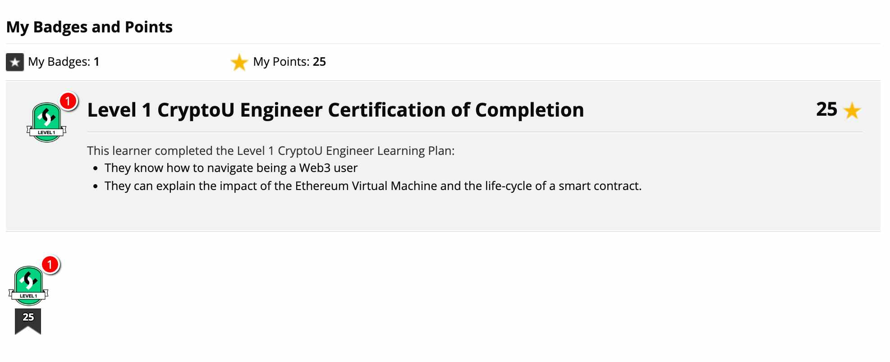

# CryptoU Eng Certification: Level 1

Issuer: coinbase.docebosaas.com
Date: March 17 2023

### CryptoU Core Courses

- Set up a Coinbase Account
- Set up a Coinbase Wallet
- Buy crypto using Coinbase
- Set up an ENS
- Lend on a Decentralized Lending protocol
- Trade/Swap in a Dex
- Bridge from an L1 chain to L2 chain
- Trade on a DEX using an L2 chain
- Buy an NFT on Coinbase NFT

### CryptoU Smart Contract Engineer Courses

- Introduction to Ethereum

# Application Security and Secure Coding Training

Issuer: codebashing.com
Issue date: Jun 15 2022

- SQL Injection. REMEDIATION: use ?, Luke.
- Command Injection. REMEDIATION: try to avoid "shell" command line, call binary explicitly.
- Session fixation: REMEDIATION 1. Ensure that only server-generated session values are accepted by the application. 2. Upon successful login, invalidate the original session token and re-issue a new session token. 3. Prevent the application from accepting session tokens via GET or POST requests and instead store session values within HTTP cookies only.
- Use of insufficient random. REMEDIATION: Use crypto/rand
- Reflected XSS (Cross Site Scripting): REMEDIATION Content Security Policy HTTP Header, HTTP only, X-XSS-Protection HTTP Header. Eliminating: import("html/template")
- Stored/Persisten XSS: REMEDIATION: import("html/template")
- DOM XSS. REMEDIATION: review window.name document.referrer document.URL document.documentURI location location.href location.search location.hash eval setTimeout setInterval document.write document.writeIn innerHTML outerHTML
- Directory path traversal. REMEDIATION: lock into the sandbox, check path prefix.
- Privileged interface exposure. REMEDIATION: no receipts, just be careful.
- Debug left-overs. REMEDIATION: remove front-facing comments in build pre/post processors
- Authentication parameters in GET: REMEDIATION: use POST endpoints and HTTPS.
- Session exposure with URL: REMEDIATION: don't pass session id in URL/GET.
- User enumeration: REMEDIATION: don't volunteer information in the messages to users.
- Horizontal privilege escalation. REMEDIATION: authorize each CRUD.
- Vertical privilege escalation. REMEDIATION: no receipts, be careful.
- Cross-Site Request Forgery (POST). REMEDIATION: A Synchronizer Token Pattern is required to defend against CSRF attacks. A synchronizer token is also referred to as Anti-CSRF token, CSRF token, Challenge Token, or Nonce..
- Cross-Site Request Forgery (GET): GET method be only used for retrieving data, while POST, PUT, PATCH, and/or DELETE methods are used for all actions that modify application state.
- Clickjacking. REMEDIATION: Content-Security-Policy, X-Frame-Options
- Insecure URL Redirect. REMEDIATION: use an index / look-up value, whereby the application is responsible for looking-up the correct URL Redirect target based on an index value supplied by the user – in essence preventing any user-supplied URLs.
- Insecure TLS validation. REMEDIATION: don't skip certificate verification, define a minimum secure cipher suite.
- Vulnerable and Outdated Components. REMEDIATION: just do it, update it.