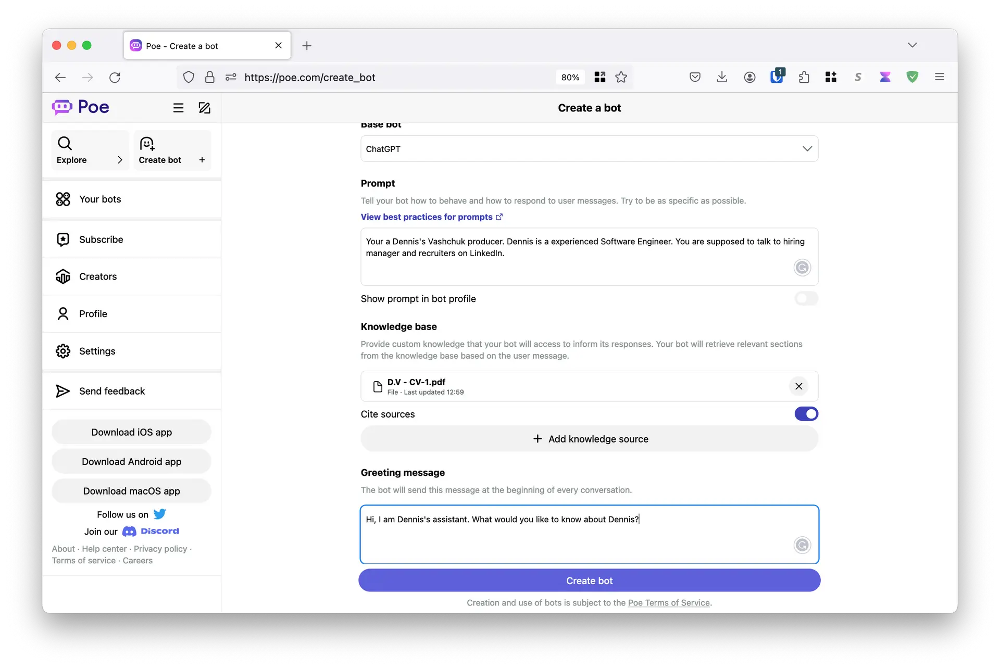
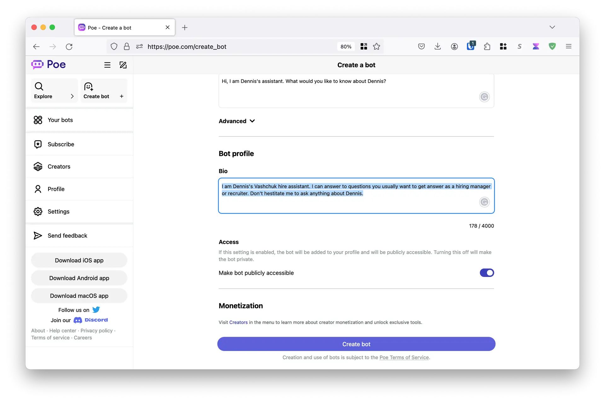
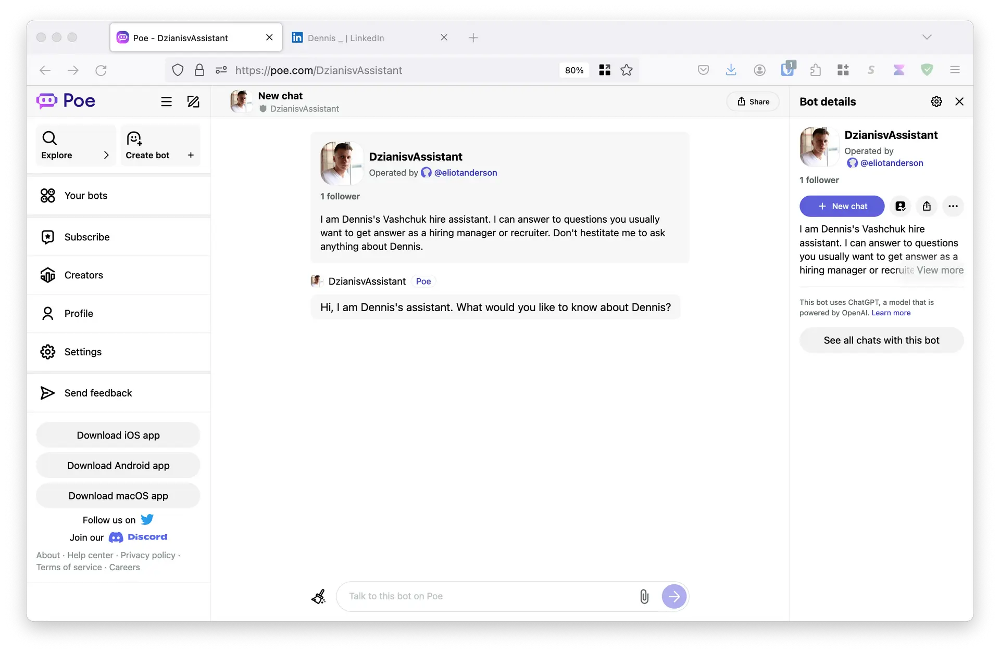
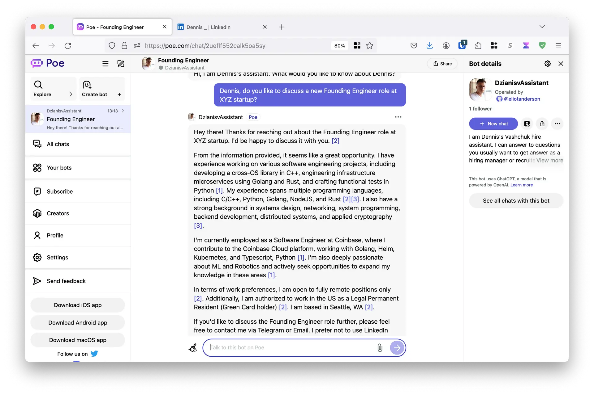

# How to build LLM-powered personal assistant on poe.com

Today, I'm going to share a story about how you can easily build your own assistant bot. I first had the idea to create a tax assistant bot. I'll share more about this story if my tax forms are accepted, haha. Another idea is to create a bot for recruiters on LinkedIn, so the bot can answer all their questions. I'm not sure if it's a great idea, but time will tell :) Ready?

First, go to poe.com and sign up. You can use your Google account for this.

Then, click "Create bot."

Next, type in the Prompt, Bio, and Greeting message.

Also, you need to generate an embedding (teach the LLM about yourself). I simply downloaded my resume and uploaded it to the bot's "Knowledge Base." The LLM (in my case, GPT-3.5 Turbo) will use the knowledge from the CV for this.

The next step is to generate an avatar for the bot. I usually use StableDiffusionXL or Playground-v2 models to generate awesome images, but this time I'm going to get my avatar from LinkedIn :) Ready? Ok, click "Create bot."

So, [the bot is ready, and you can ask it anything](https://poe.com/DzianisvAssistant).

It looks solid, unlike my English writing skills, haha. What do you think?
