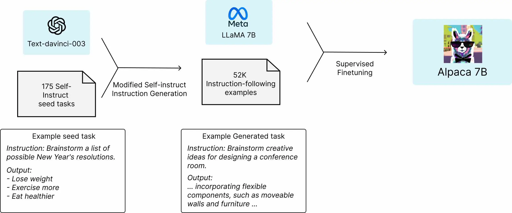
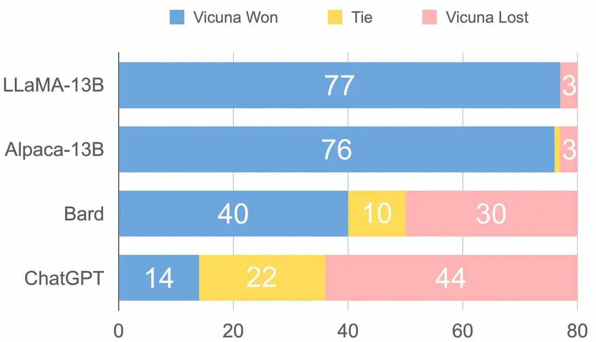
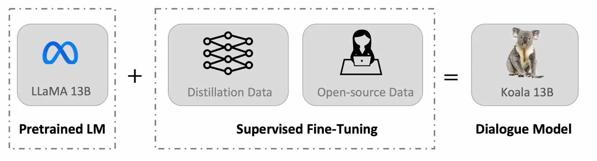

# Text To Speech

## [Coqui TTS](https://github.com/coqui-ai/TTS)

The best open source TTS engine I have ever used, but not very suitable for embedded devices because it take a lot of time to generate a speech.

TTS is a library for advanced Text-to-Speech generation. It's built on the latest research, was designed to achieve the best trade-off among ease-of-training, speed and quality. 🐸TTS comes with pretrained models, tools for measuring dataset quality and already used in 20+ languages for products and research projects.

```sh
pip install TTS
tts --text "Text for TTS" --out_path output/path/speech.wav
```


A Russian [model](https://discourse.mozilla.org/t/training-russian-tts/70381/3) are availble as well.

# Language Models

Instruction-following models such as GPT-3.5 (text-davinci-003), ChatGPT, Claude, and Bing Chat have become increasingly powerful.  [Reference](https://crfm.stanford.edu/2023/03/13/alpaca.html)

## LLaMA
Smaller, more performant models such as LLaMA enable others in the research community who don’t have access to large amounts of infrastructure to study these models, further democratizing access in this important, fast-changing field.

Training smaller foundation models like LLaMA is desirable in the large language model space because it requires far less computing power and resources to test new approaches, validate others’ work, and explore new use cases. Foundation models train on a large set of unlabeled data, which makes them ideal for fine-tuning for a variety of tasks. We are making LLaMA available at several sizes (7B, 13B, 33B, and 65B parameters)

Smaller models trained on more tokens — which are pieces of words — are easier to retrain and fine-tune for specific potential product use cases. We trained LLaMA 65B and LLaMA 33B on 1.4 trillion tokens. Our smallest model, LLaMA 7B, is trained on one trillion tokens.

**Like other large language models, LLaMA works by taking a sequence of words as an input and predicts a next word to recursively generate text. To train our model, we chose text from the 20 languages with the most speakers, focusing on those with Latin and Cyrillic alphabets.** [Reference](https://ai.facebook.com/blog/large-language-model-llama-meta-ai/)

Model date LLaMA was trained between December. 2022 and Feb. 2023.
Model type LLaMA is an auto-regressive language model, based on the transformer architecture. The model comes in different sizes: 7B, 13B, 33B and 65B parameters.
[Reference](https://github.com/facebookresearch/llama/blob/main/MODEL_CARD.md)

## [LLaMA.cpp](https://github.com/ggerganov/llama.cpp)


## [RedPajama]()

An effort to produce a reproducible, fully-open, leading language model. RedPajama is a collaboration between Together, Ontocord.ai, ETH DS3Lab, Stanford CRFM, and Hazy Research. RedPajama has three key components:

- Pre-training data, which needs to be both high quality and have broad coverage

- Base models, which are trained at scale on this data

- Instruction tuning data and models, which improve the base model to make it usable and safe

The RedPajama base dataset is a 1.2 trillion token fully-open dataset created by following the recipe described in the LLaMA paper.

[Reference](https://www.together.xyz/blog/redpajama)

## [Standfor Alpaca](https://crfm.stanford.edu/2023/03/13/alpaca.html)

We introduce Alpaca 7B, a model fine-tuned from the LLaMA 7B model on 52K instruction-following demonstrations. On our preliminary evaluation of single-turn instruction following, Alpaca behaves qualitatively similarly to OpenAI’s text-davinci-003, while being surprisingly small and easy/cheap to reproduce (<600$).

Alpace is fine-tuned from Meta’s LLaMA 7B model. We train the Alpaca model on 52K instruction-following demonstrations generated in the style of self-instruct using text-davinci-003. On the self-instruct evaluation set, Alpaca shows many behaviors similar to OpenAI’s text-davinci-003, but is also surprisingly small and easy/cheap to reproduce.



We emphasize that Alpaca is intended only for academic research and any **commercial use is prohibited**. There are three factors in this decision: First, Alpaca is based on LLaMA, which has a non-commercial license, so we necessarily inherit this decision. Second, the instruction data is based on OpenAI’s text-davinci-003, whose terms of use prohibit developing models that compete with OpenAI.[Reference](https://crfm.stanford.edu/2023/03/13/alpaca.html)


Self-Instrcut ipeline generates instruction, input, and output samples from a language model, then prunes them before using them to finetune the original model. Applying our method to vanilla GPT3, we demonstrate a 33% absolute improvement over the original model on Super-NaturalInstructions, on par with the performance of InstructGPT_001, which is trained with private user data and human annotations [Reference](https://arxiv.org/abs/2212.10560)

## [Vicuna](https://pub.towardsai.net/meet-vicuna-the-latest-metas-llama-model-that-matches-chatgpt-performance-e23b2fc67e6b)

Vicuna-13B is a new open-source chatbot that has been developed to address the lack of training and architecture details in existing large language models (LLMs) such as OpenAI’s ChatGPT. Vicuna-13B is trained by fine-tuning a LLaMA base model using approximately 70,000 user-shared conversations gathered from ShareGPT.com, resulting in an enhanced dataset. The preliminary evaluation of Vicuna-13B using GPT-4 as a judge shows that it achieves over 90% quality of OpenAI ChatGPT and Google Bard while outperforming other models like LLaMA and Stanford Alpaca in more than 90% of cases.



The team then asks GPT-4 to rate the quality of the chatbots’ answers based on helpfulness, relevance, accuracy, and detail. GPT-4 produces relatively consistent scores and provides detailed explanations of why such scores are given. However, the team notes that GPT-4 is not very good at judging coding/math tasks. [Reference](https://pub.towardsai.net/meet-vicuna-the-latest-metas-llama-model-that-matches-chatgpt-performance-e23b2fc67e6b)


## [Dolly](https://github.com/databrickslabs/dolly)

Databricks’ Dolly is an instruction-following large language model trained on the Databricks machine learning platform that is licensed for commercial use. Based on pythia-12b, Dolly is trained on ~15k instruction/response fine tuning records databricks-dolly-15k generated by Databricks employees in capability domains from the InstructGPT paper, including brainstorming, classification, closed QA, generation, information extraction, open QA and summarization. dolly-v2-12b is not a state-of-the-art model, but does exhibit surprisingly high quality instruction following behavior not characteristic of the foundation model on which it is based.

## [Pythia](https://github.com/EleutherAI/pythia)

[Reference](https://arxiv.org/pdf/2304.01373.pdf)

## [Koala]()


chatbot trained by fine-tuning Meta’s LLaMA on dialogue data gathered from the web. The Koala model was trained on a single Nvidia DGX server with 8 A100 GPUs, and the training took 6 hours to complete for 2 epochs. It also mentions that on public cloud computing platforms, such a training run typically costs less than $100 with preemptible instances.

Koala to ChatGPT and Stanford's Alpaca, Koala's responses were often preferred over Alpaca, and in over half of the cases, Koala's performance was at least tied with ChatGPT. This suggests that Koala performs competitively and effectively in generating responses to user queries.[Reference](https://bair.berkeley.edu/blog/2023/04/03/koala)

## [FastChat](https://github.com/lm-sys/FastChat)
FastChat is an open platform for training, serving, and evaluating large language model based cha   tbots. The core features include:

- The weights, training code, and evaluation code for state-of-the-art models (e.g., Vicuna, FastChat-T5).
- A distributed multi-model serving system with Web UI and OpenAI-compatible RESTful APIs.

## TODO
- GPT-NeoXT-Chat-Base-20B
- Pythia-Chat-Base-7B

# Image Generation

## [Stable Diffusion 2.1](https://huggingface.co/spaces/stabilityai/stable-diffusion)

[Demo](https://stablediffusionweb.com/#demo)

Project [github.com](https://github.com/CompVis/stable-diffusion)

## [DiffusionBee](https://github.com/divamgupta/diffusionbee-stable-diffusion-ui)


# Software Engineering
##  [StarCoder]()

Codex and CoPilot had a big impact on the community and developers and can lead to a significant productivity boost in the professional workflow. However, those models are closed source, so you cannot freely adapt them to your use-case or experiment with fine-tuning and you need to send your data to an external API. In addition, there are big open questions around data governance: what data was trained on, what licenses were included, how to attribute sources, and what if you want to be excluded? There are several open models, but they lack CoPilot’s performance and also don’t fully disclaim how the dataset was created and filtered.

The goal of BigCode and subsequently StarCoder was to address these issues and produce a high-performance code model with clear data governance structures. The project is a spiritual successor of BigScience and is run as an open research collaboration where every research or industry expert can join. [Reference](https://thesequence.substack.com/p/the-sequence-chat-hugging-faces-leandro?utm_source=substack&utm_medium=email)

StarCoderBase is trained on 80+ programming languages for 1T tokens. Since a lot of developers are working on Python we continued to trainStarCoder for about 35B tokens (~3% of full training) on the Python subset which lead to a significant performance boost. Surprisingly, it also lead to a performance increase in some other languages such as R or Swift.  [Reference](https://github.com/huggingface/blog/blob/main/starchat-alpha.md)

The data curation probably made up 60-80% of the whole project. There were two main ingredients to create a good pretraining dataset. First, we applied strong near-deduplication where similar files are removed. It might sound counterintuitive, but first strongly near-deduplicating the dataset allows you to safely train for a few epochs without performance degradation. Second, for each file extension we examined at least 100 samples and derived heuristics to exclude low quality files (e.g. data or auto-generated files). In addition we labelled a PII dataset for code to train a PII detector. At that scale even applying that PII model to the whole dataset required several hundred GPU hours. Also, we excluded code files from users that had opted out of the dataset.

Finally, for the training we used 512 A100 GPUs for 24 days to train the model. The training was extremely smooth. We had some restarts due to hardware failures but those mostly happened automatically. Training at that scale with modern tools such as Megatron and using BF16 is very smooth.

## [CodeTF](https://github.com/salesforce/codetf)
| Model        | Size                                                                                                                          | Tasks                                                                                                                                                                                                     |
|--------------|-------------------------------------------------------------------------------------------------------------------------------|-------------------------------------------------------------------------------------------------------------------------------------------------|
| CodeT5       | Base, Base-multi-sum, Base-translate-cs, Base-translate-java, Base-sum, Base-clone, Base-defect                              | Pretrained, NL to Code, Refine, Translation (CS to Java, Java to CS), Summarization (Python, Go, PHP, JavaScript, Java, Ruby), Clone detection, Defect prediction |
| CodeT5+      | Plus-instruct-16B, Plus-16B, Plus-6B, Plus-2B, Plus-770M-python, Plus-770M, Plus-220M                                      | Pretrained, NL to Code, Refine , Defect prediction |
| CodeGen      | Mono: 350M, 2B, 6B, 1B, 3.7B, 7B, 16B<br>Multi: 350M, 2B, 6B<br>NL: 350M, 2B                                           | Pretrained |
| StarCoder    | 15.5B                                                                                                                         | Pretrained |
| SantaCoder   | 1.1B                                                                                                                          | Pretrained |
| GPT-NeoX     | 20B                                                                                                                           | Pretrained |
| GPT-Neo      | 1.3B                                                                                                                          | Pretrained |
| GPT-J        | 6B                                                                                                                            | Pretrained |
| Incoder      | 6B                                                                                                                            | Pretrained |
| CodeParrot   | Small-python (110M), Small-multi(110M), 1.5B                                                                                   | Pretrained |
| CodeBERT     | CodeBERT-base, UnixCoder-base, CodeBERTa-small                                                                                 | Pretrained |

## [AutoGPT](https://github.com/Significant-Gravitas/Auto-GPT)


## Proxies

- [Python, gpt4free](https://github.com/xtekky/gpt4free
- [Python, Poe](https://github.com/ading2210/poe-api)
