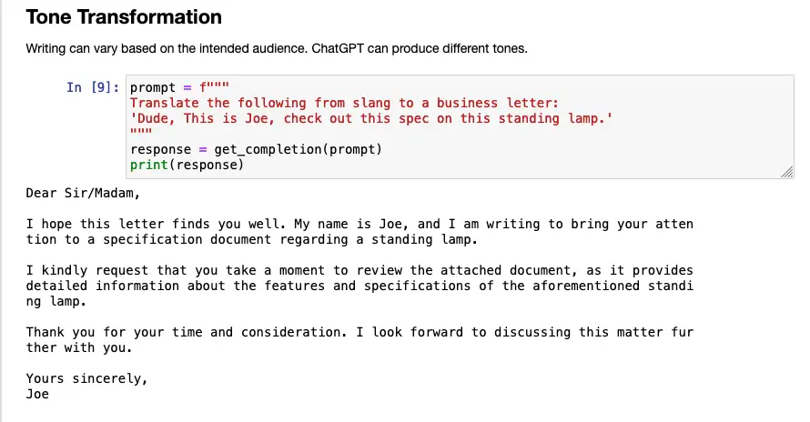
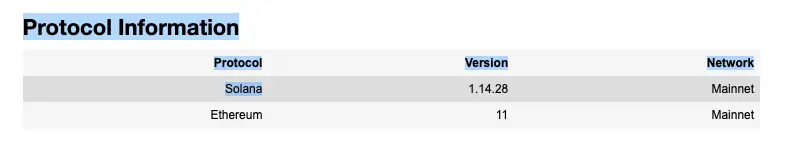
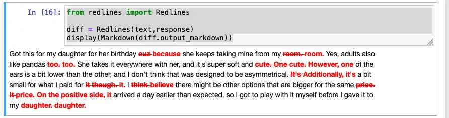

https://learn.deeplearning.ai/chatgpt-prompt-eng/lesson/2/guidelines

Base LLM: Once upon a time there was a unicorn that live in a magical world.

Instruction Tuned LLM. Uses Reinforment Learning Human Feedback. Helpful. Honest. Harmless. For instance: Whait is the capita? The capital of France is Paris.

Give instruction that a smart enough but don't know specific of your task.


The nice thing that this course is interactive and you can play with ChatGPT on the course webpage


# Principles
## Princeple 1: Write clear and specific instructions

1. Write the clear and specific instructions
""", ```, ---, <>, <tag></tag>
> Fix mistakes and rewrite text delimited by triple backticks into a generic cover latter for Software Engineer

2. Ask for structured output
HTML, JSON
> Generate a list of three made-up book titles along with their authors and genres.  Provide them in JSON format with the following keys:  book_id, title, author, genre.

3. Ask the model to check whether conditions are satisfied
Check assumptions required to do the task

> You will be provided with text delimited by triple quotes.
> If it contains a sequence of instructions, \
> re-write those instructions in the following format:
> Step 1 - ...
> Step 2 - …
> …
> Step N - …
> If the text does not contain a sequence of instructions, \
> then simply write \"No steps provided.\"

4. "Few-shot" prompting
Give succesfsful examples of compteling tasks
Then ask model to perfom the task

> Your task is to answer in a consistent style.
> <child>: Teach me about patience.
> <grandparent>: The river that carves the deepest \
> valley flows from a modest spring; the \
> grandest symphony originates from a single note; \
> the most intricate tapestry begins with a solitary thread.
> <child>: Teach me about resilience.

## Principle 2: Give the model time to think

1. Specify the steps to complete the task
> Your task is to perform the following actions:
> 1 - Summarize the following text delimited by
>  <> with 1 sentence.
> 2 - Translate the summary into French.
> 3 - List each name in the French summary.
> 4 - Output a json object that contains the
>  following keys: french_summary, num_names.
> Use the following format:
> Text: <text to summarize>
> Summary: <summary>
> Translation: <summary translation>
> Names: <list of names in Italian summary>
> Output JSON: <json with summary and num_names>
>
> Text: <{text}>

2. Instruct the model to work out its own solution before rushing to a conclusion¶

> Your task is to determine if the student's solution \
> is correct or not.
> To solve the problem do the following:
> - First, work out your own solution to the problem.
> - Then compare your solution to the student's solution \
> and evaluate if the student's solution is correct or not.
> Don't decide if the student's solution is correct until
> you have done the problem yourself.


## Model Limitations

- Hallucination
``` python
prompt = f"""
Tell me about AeroGlide UltraSlim Smart Toothbrush by Boie
"""
response = get_completion(prompt)
print(response)
prompt = f"""
Tell me about AeroGlide UltraSlim Smart Toothbrush by Boie
"""
response = get_completion(prompt)
print(response)
```

> The AeroGlide UltraSlim Smart Toothbrush by Boie is a technologically advanced toothbrush designed to provide a superior brushing experience. Boie is a company known for its innovative oral care products, and the AeroGlide UltraSlim Smart Toothbrush is no exception.

How to reduce hallucinations:
1. Find relevant information
2. Answer the question absed on the relevan information.


- Make setatement that sound plausible but are not true

# Interactive Prompt Development

- Try something
- Analyze where the result does not give what you want
- Clarify instructions, give more time to think
- Refine prompts with a batch of examples

# Sumarizing

>Your task is to generate a short sumary of a product \ review from an ecomerce site. Sumarize the review below, delimited by <<< >>>, in at most 30 worlds.

or

> Your task is to extract relevant information from a product review from an ecommerce site to give feedback to the Shipping department. From the review bellow delemited by <<< >>>


# Inferring

Prompt examples

> What is the senteimet of the following product review, which is delimited with tripple backtriks. Review text ```{text}```

> Identify a list of emotions that the writer of the following review is expressing. Include no more than five items in the list. Format your answer as a list of lower-case words separated by commas.

> Is the writer of the following review expressing anger? The review is delimietd with triple backtricks. Give you answer as either yes or no.

> Identiyf the following items from the review text:
> - Items purchases by the reviwer
> - Company that made the item
> The reive is delimited with triple backtricks.

> Determine five topics that are being discussed in the following text, which is delimited by triple backtricks. Make each item one or two words long. Format your response as a list of items separated by commas. Text sample ```{story}```

## Make a news alert for certain topics
> Determine whether each item in the followin list of topics is atopic in the text bellow, which is delmited with triple backtricks. Give you answer as list with 0 or 1 for each topic. List of topcs {topic_list}. Text sample ```{story}```

# Transforming


## Translation
> Translate the following English text to Spanish: ```{text}```

> Tell me which language this is: ```{text}```

> Translate the following text to Spanish in both the formal and informal forms: ```{text}```

## Tone transformation

> Translate the following from slang to a business letter ```{text}```




## Format


```jupyter
data_json = {"protocols": {"solana": {"version": "1.14.28", "network": "mainnet"}, "ethereum": {"version": "11", "network": "mainnet"}}}


prompt = f"""
Translate the following python dictionary from JSON to an HTML \
table with column headers and title: {data_json}
"""
response = get_completion(prompt)
from IPython.display import display, Markdown, Latex, HTML, JSON display(HTML(response))
```



## Spellcheck / Grammar Check

> "Proofread and correct the following text and rewrite the corrected version. If you don't find and errors, just say "No errors found". Don't use  any punctuation around the text: ```{text}```

> proofread and correct this review. Make it more compelling.  Ensure it follows APA style guide and targets an advanced reader.  Output in markdown format.

```jupyter
prompt = f"proofread and correct this review: ```{text}```"
response = get_completion(prompt)
from redlines import Redlines

diff = Redlines(text,response)
display(Markdown(diff.output_markdown))
```

