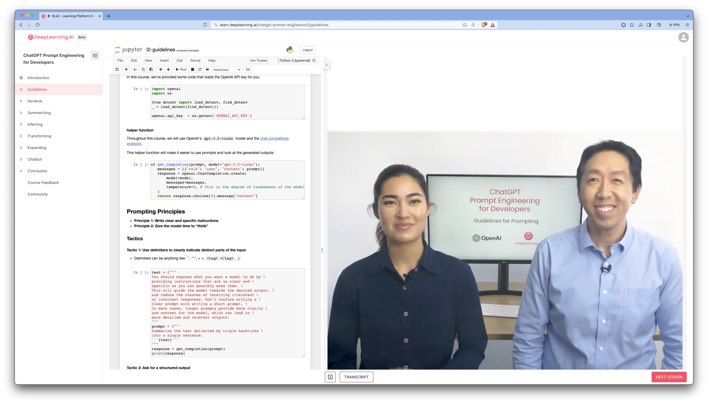
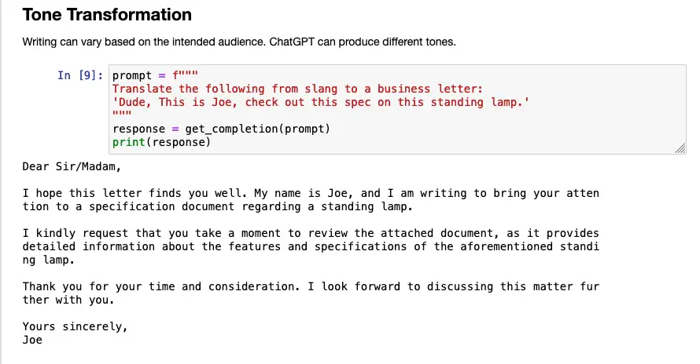
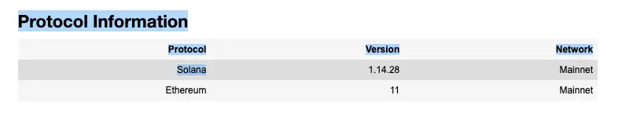
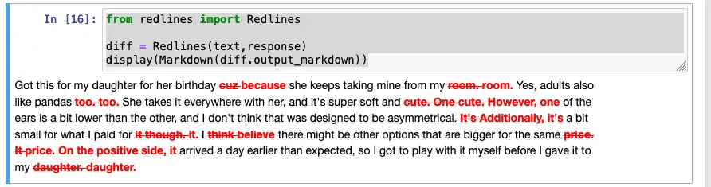
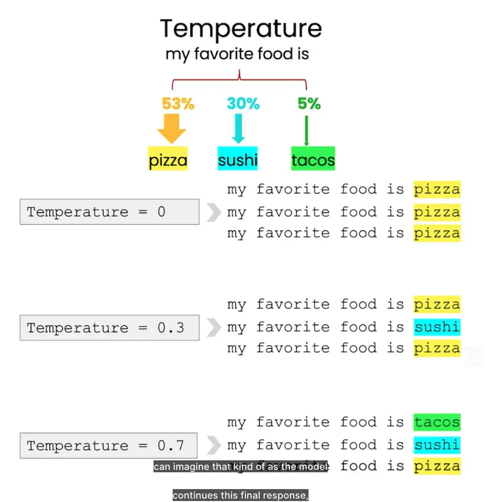
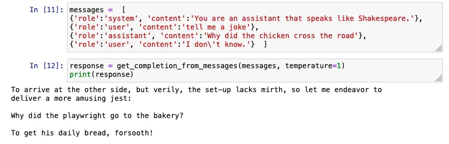

# LLM Prompt Engineering

[Course](https://learn.deeplearning.ai/chatgpt-prompt-eng/)

Base LLM: Once upon a time there was a unicorn that live in a magical world.

Instruction Tuned LLM. Uses Reinforment Learning Human Feedback. Helpful. Honest. Harmless. For instance: Whait is the capita? The capital of France is Paris.

Give instruction that a smart enough but don't know specific of your task.


The nice thing that this course is interactive and you can play with ChatGPT on the course webpage




```python
import openai
import os

from dotenv import load_dotenv, find_dotenv
_ = load_dotenv(find_dotenv()) # read local .env file
openai.api_key  = os.getenv('OPENAI_API_KEY')

def get_completion(prompt, model="gpt-3.5-turbo",temperature=0): # Andrew mentioned that the prompt/ completion paradigm is preferable for this class
    messages = [{"role": "user", "content": prompt}]
    response = openai.ChatCompletion.create(
        model=model,
        messages=messages,
        temperature=temperature, # this is the degree of randomness of the model's output
    )
    return response.choices[0].message["content"]
```

# Principles
## Princeple 1: Write clear and specific instructions

1. Write the clear and specific instructions
""", ```, ---, <>, <tag></tag>
> Fix mistakes and rewrite text delimited by triple backticks into a generic cover latter for Software Engineer

2. Ask for structured output
HTML, JSON
> Generate a list of three made-up book titles along with their authors and genres.  Provide them in JSON format with the following keys:  book_id, title, author, genre.

3. Ask the model to check whether conditions are satisfied
Check assumptions required to do the task

> You will be provided with text delimited by triple quotes.
> If it contains a sequence of instructions, \
> re-write those instructions in the following format:
> Step 1 - ...
> Step 2 - …
> …
> Step N - …
> If the text does not contain a sequence of instructions, \
> then simply write \"No steps provided.\"

4. "Few-shot" prompting
Give succesfsful examples of compteling tasks
Then ask model to perfom the task

> Your task is to answer in a consistent style.
> <child>: Teach me about patience.
> <grandparent>: The river that carves the deepest \
> valley flows from a modest spring; the \
> grandest symphony originates from a single note; \
> the most intricate tapestry begins with a solitary thread.
> <child>: Teach me about resilience.

## Principle 2: Give the model time to think

1. Specify the steps to complete the task
> Your task is to perform the following actions:
> 1 - Summarize the following text delimited by
>  <> with 1 sentence.
> 2 - Translate the summary into French.
> 3 - List each name in the French summary.
> 4 - Output a json object that contains the
>  following keys: french_summary, num_names.
> Use the following format:
> Text: <text to summarize>
> Summary: <summary>
> Translation: <summary translation>
> Names: <list of names in Italian summary>
> Output JSON: <json with summary and num_names>
>
> Text: <{text}>

2. Instruct the model to work out its own solution before rushing to a conclusion¶

> Your task is to determine if the student's solution \
> is correct or not.
> To solve the problem do the following:
> - First, work out your own solution to the problem.
> - Then compare your solution to the student's solution \
> and evaluate if the student's solution is correct or not.
> Don't decide if the student's solution is correct until
> you have done the problem yourself.


## Model Limitations

- Hallucination
``` python
prompt = f"""
Tell me about AeroGlide UltraSlim Smart Toothbrush by Boie
"""
response = get_completion(prompt)
print(response)
prompt = f"""
Tell me about AeroGlide UltraSlim Smart Toothbrush by Boie
"""
response = get_completion(prompt)
print(response)
```

> The AeroGlide UltraSlim Smart Toothbrush by Boie is a technologically advanced toothbrush designed to provide a superior brushing experience. Boie is a company known for its innovative oral care products, and the AeroGlide UltraSlim Smart Toothbrush is no exception.

How to reduce hallucinations:
1. Find relevant information
2. Answer the question absed on the relevan information.


- Make setatement that sound plausible but are not true

# Interactive Prompt Development

- Try something
- Analyze where the result does not give what you want
- Clarify instructions, give more time to think
- Refine prompts with a batch of examples

# Sumarizing

>Your task is to generate a short sumary of a product \ review from an ecomerce site. Sumarize the review below, delimited by <<< >>>, in at most 30 worlds.

or

> Your task is to extract relevant information from a product review from an ecommerce site to give feedback to the Shipping department. From the review bellow delemited by <<< >>>


# Inferring

Prompt examples

> What is the senteimet of the following product review, which is delimited with tripple backtriks. Review text ```{text}```

> Identify a list of emotions that the writer of the following review is expressing. Include no more than five items in the list. Format your answer as a list of lower-case words separated by commas.

> Is the writer of the following review expressing anger? The review is delimietd with triple backtricks. Give you answer as either yes or no.

> Identiyf the following items from the review text:
> - Items purchases by the reviwer
> - Company that made the item
> The reive is delimited with triple backtricks.

> Determine five topics that are being discussed in the following text, which is delimited by triple backtricks. Make each item one or two words long. Format your response as a list of items separated by commas. Text sample ```{story}```

## Make a news alert for certain topics
> Determine whether each item in the followin list of topics is atopic in the text bellow, which is delmited with triple backtricks. Give you answer as list with 0 or 1 for each topic. List of topcs {topic_list}. Text sample ```{story}```

# Transforming


## Translation
> Translate the following English text to Spanish: ```{text}```

> Tell me which language this is: ```{text}```

> Translate the following text to Spanish in both the formal and informal forms: ```{text}```

## Tone transformation

> Translate the following from slang to a business letter ```{text}```




## Format


```python
data_json = {"protocols": {"solana": {"version": "1.14.28", "network": "mainnet"}, "ethereum": {"version": "11", "network": "mainnet"}}}


prompt = f"""
Translate the following python dictionary from JSON to an HTML \
table with column headers and title: {data_json}
"""
response = get_completion(prompt)
from IPython.display import display, Markdown, Latex, HTML, JSON display(HTML(response))
```



## Spellcheck / Grammar Check

> "Proofread and correct the following text and rewrite the corrected version. If you don't find and errors, just say "No errors found". Don't use  any punctuation around the text: ```{text}```

> proofread and correct this review. Make it more compelling.  Ensure it follows APA style guide and targets an advanced reader.  Output in markdown format.

```python
prompt = f"proofread and correct this review: ```{text}```"
response = get_completion(prompt)
from redlines import Redlines

diff = Redlines(text,response)
display(Markdown(diff.output_markdown))
```



## Expanding

## Customize the automated reply to a customer email

> you are customer service AI assistant. Your task is to send an email reply to a valued customer. Given the customer email delimited by ```, generate a reply to thank the customer for their review. If the sentiment is positve or neutral, thank them for their review. If the sentimenet is negative, apologyize and suggest that they can reach out to customer serice. Make sure to use specific details from the review. Write a concise and professional tone. Sign the email as `AI customer agent`. Customer revifew ```{review}```, Review sentiment {sentiment}

# Temperature

Temperature - degree of randomness.



When you want a predictable response, use  temperature 0.
If you want to use model in the creative way, use higher temperature.


# Chatbots

```python
messages = [
    {'role': 'system', 'content': 'You are an assistant that speaks like Shakespere.'],
    {'role': 'user', 'content': 'tell me a joke'},
    'role':'assistant', 'content':'Why did the chicken cross the road'},
    {'role':'user', 'content':'I don\'t know'}
]
```



## Order bot

```python
def collect_messages(_):
    prompt = inp.value_input
    inp.value = ''
    context.append({'role':'user', 'content':f"{prompt}"})
    response = get_completion_from_messages(context)
    context.append({'role':'assistant', 'content':f"{response}"})
    panels.append(
        pn.Row('User:', pn.pane.Markdown(prompt, width=600)))
    panels.append(
        pn.Row('Assistant:', pn.pane.Markdown(response, width=600, style={'background-color': '#F6F6F6'})))

    return pn.Column(*panels)

import panel as pn  # GUI
pn.extension()

panels = [] # collect display

context = [ {'role':'system', 'content':"""
You are OrderBot, an automated service to collect orders for a pizza restaurant. \
You first greet the customer, then collects the order, \
and then asks if it's a pickup or delivery. \
You wait to collect the entire order, then summarize it and check for a final \
time if the customer wants to add anything else. \
If it's a delivery, you ask for an address. \
Finally you collect the payment.\
Make sure to clarify all options, extras and sizes to uniquely \
identify the item from the menu.\
You respond in a short, very conversational friendly style. \
The menu includes \
pepperoni pizza  12.95, 10.00, 7.00 \
cheese pizza   10.95, 9.25, 6.50 \
eggplant pizza   11.95, 9.75, 6.75 \
fries 4.50, 3.50 \
greek salad 7.25 \
Toppings: \
extra cheese 2.00, \
mushrooms 1.50 \
sausage 3.00 \
canadian bacon 3.50 \
AI sauce 1.50 \
peppers 1.00 \
Drinks: \
coke 3.00, 2.00, 1.00 \
sprite 3.00, 2.00, 1.00 \
bottled water 5.00 \
"""} ]  # accumulate messages


inp = pn.widgets.TextInput(value="Hi", placeholder='Enter text here…')
button_conversation = pn.widgets.Button(name="Chat!")

interactive_conversation = pn.bind(collect_messages, button_conversation)

dashboard = pn.Column(
    inp,
    pn.Row(button_conversation),
    pn.panel(interactive_conversation, loading_indicator=True, height=300),
)

dashboard
```

Then we can ask to output an order json
Use temperature about 0 to make otuput predictable
```python
messages.append(
{'role':'system', 'content':'create a json summary of the previous food order. Itemize the price for each item\
 The fields should be 1) pizza, include size 2) list of toppings 3) list of drinks, include size   4) list of sides include size  5)total price '},
)

response = get_completion_from_messages(messages, temperature=0)
```

# Sumary
Principles
- Write clear and specific instructions
- Give the model time to "think"
Capabilities: Summarizing, Inferring, Transforming, Expanding

# Use Cases
```python
lamp_review = """
Needed a nice lamp for my bedroom, and this one had \
additional storage and not too high of a price point. \
Got it fast.  The string to our lamp broke during the \
transit and the company happily sent over a new one. \
Came within a few days as well. It was easy to put \
together.  I had a missing part, so I contacted their \
support and they very quickly got me the missing piece! \
Lumina seems to me to be a great company that cares \
about their customers and products!!
"""
```


