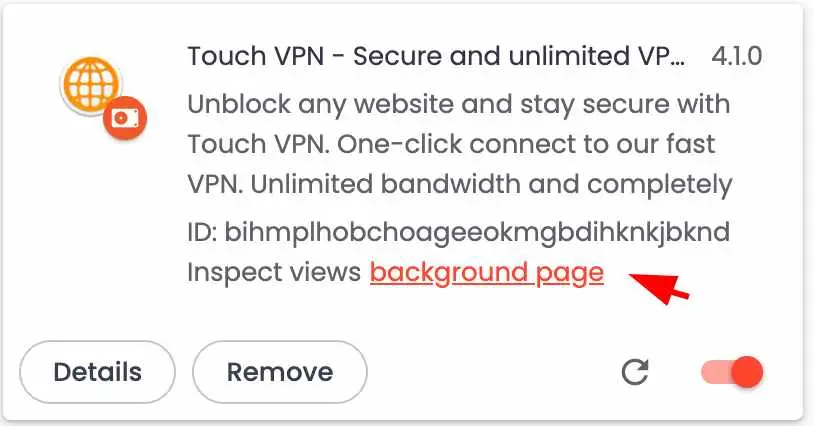
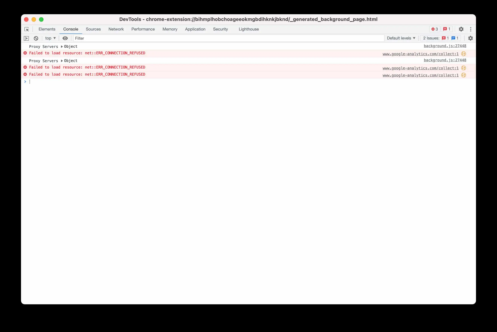
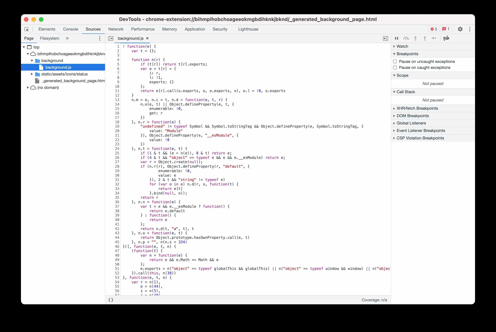

# Decoding the Code: An In-Depth Analysis of Chrome Extensions
Ever wondered what goes on behind the scenes of your favourite Google Chrome, Chromium, or Brave plugin? This guide will walk you through the steps to retrieve and analyze the plugin's code.

## Step 1: Begin with the Basics
First off, you need to download and install a browser from the Chrome Store. It's like preparing the canvas before the paint flies.

## Step 2: Location, Location, Location
Chromium-based browsers keep the plugin hidden in the Default/Extension profile folder. To access it, you can follow this path:
```
$ cd ~/Library/Application\ Support/BraveSoftware/Brave-Browser/Default/Extensions
```

## Step 3: Hide and Seek
Chromium employs unique IDs for folders with plugins, so finding them by name is a no-go. But don't fret, you have options. You can either use grep to locate the plugin, or you can check the modification time of the root plugin directory ls -lt to spot the plugin of interest. The latter option will look something like this:

```
ls -lta
total 0
drwx------@ 78 engineer  staff  2496 Jun  2 15:55 ..
drwx------@ 10 engineer  staff   320 Jun  2 15:45 .
drwx------@  2 engineer  staff    64 Jun  2 15:14 Temp
drwx------@  3 engineer  staff    96 Jun  1 18:46 baecjmoceaobpnffgnlkloccenkoibbb
drwx------@  3 engineer  staff    96 May 28 21:14 nenlahapcbofgnanklpelkaejcehkggg
```

## Step 4: Get to Know the Guide
Now, you're ready to check the manifest and find the background script. It's usually named background.js - kind of like a backstage pass to the show.

## Step 5: Demystify the Code
Be warned! The background.js is often obfuscated, which means you need to unscramble it. You can do this using online or command-line tools. I found that the beautifier does an excellent job at this.

## Step 6: Become the Critic
The final step? Review the code! Congratulations, you've reached the end of your journey. With your new understanding of Chrome extensions, you're ready to take on the browser world!

## Step 7: Debug Like a Pro

Debugging is a crucial part of understanding any code, and Chromium's developer tools make this process remarkably straightforward.

First, you need to access the extension's background page. Navigate to `chrome://extensions/` in your browser, and enable Developer mode from the top right corner.


Once you've done this, you'll see additional details for each installed extension. Look for your extension and click on the `background page` link. This will open a new Developer Tools window specifically for the extension.


In this window, you can utilize the "Console" tab to view output from `console.log` statements in your extension's code. This is invaluable for seeing real-time feedback as your extension runs.


Moreover, the "Sources" tab is where the magic happens for breakpoint debugging. Here, you can view all scripts loaded by the extension. By clicking on a line number, you can set a breakpoint, which will pause execution of the code at that point. This allows you to inspect all variables and the call stack at that moment in time.

Remember, debugging isn't just about squashing bugs, it's also about understanding how the code flows and interacts. So put on your detective hat and start debugging!

---
