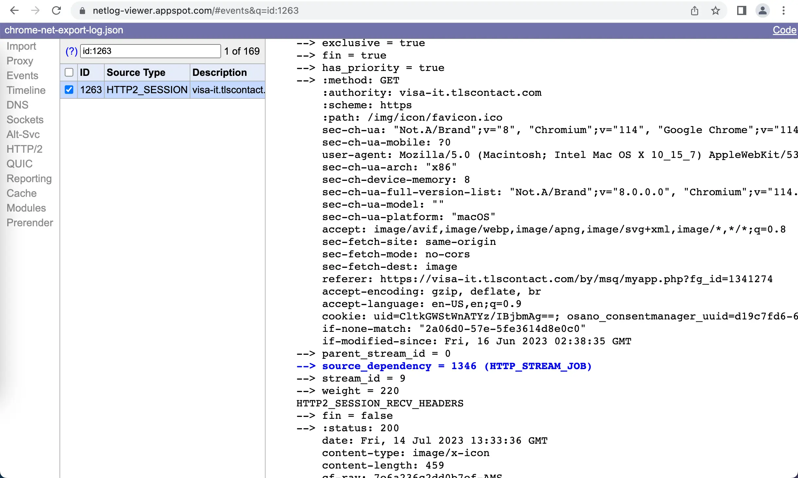

Chrome have a nice feature that allows to record all the network "events". It is like a wireshark dump, but better, because you can see an encrypted data.

To start dumping, go to `chrome://net-export/` and click "Start".

To analyze dump use [netlog-viewer.appspot.com](https://netlog-viewer.appspot.com/).
There you can see HTTP session headers and data transfered in human readabl way,

