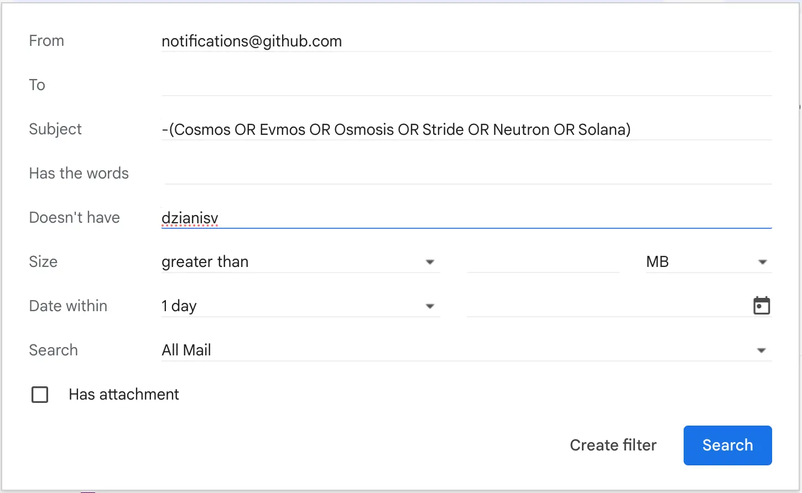

# Github Gmail notifications filter
Short note about filtering.

At my current position I owns some microservices in the github monorepo.
The monorepo generates a lot of notifcations when someone contributes and creates PRs there.
It creates a lot of notifications that I would avoid, therefore I setup a filter in gmail for that

In subject I set a blockchain protcols I am interested in, and `-` means not. So if there an email with for a PR for another protocol, gmail going to delete it.

Keep you mind far away from distraction. Use gmail filters and meditations!

