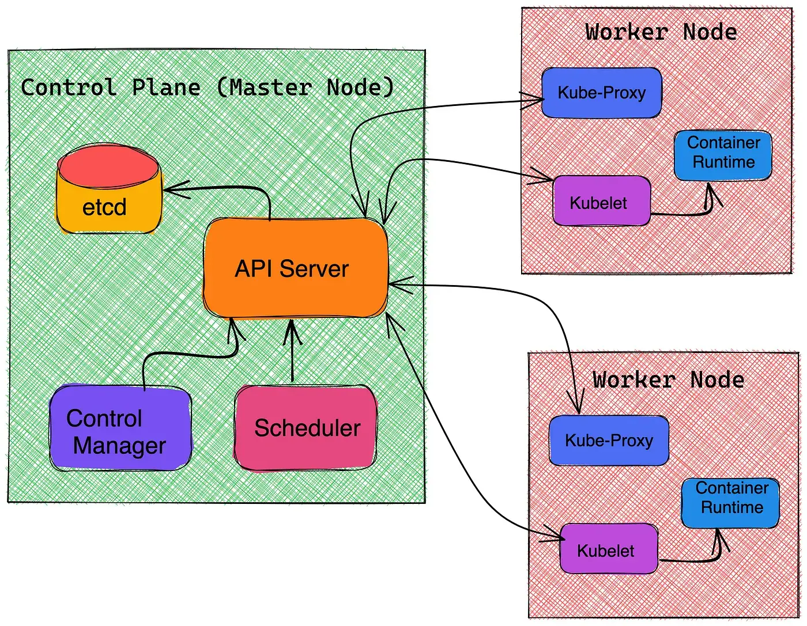

# Kubernetest Internals

Kubernetes follows the declarative model, what that means is as the user you provide K8s what are you need in the cluster and K8s does all the heavy lifting to maintain the desired state provided by the user. Those declarative commands user provides are referred to as manifest, often a YAML file with predefined keys and values.

## Control Plane

The **control manager** or controller is the watch-hawk of the control plane. It monitors the cluster continuously to make sure the current state of the cluster is the same as the desired state. Whenever the current state drifts from the desired state control manager inform the API server to do the necessary actions. There are several different types of controllers available each Kubernetes resource type.,
- ReplicaSet
- Deployment
- StatefulSet
- Job
- CronJob
- DeamonSet

It is also worth noting that controllers can be run outside the control plane and it is also possible to write custom controllers to satisfy distinct needs.

> Controllers are control loops that watch the state of your cluster and tries to move the current cluster state closer to the desired state.

**etcd** is the persistent store within the control plane. etcd is a key-value store where all the cluster data like the number of instances to run, how much the cluster scales up or down depending upon the network traffic, details about the namespace, internal DNS, etc. etcd is only accessible to the API server for security reasons.
> Any cluster related state or data will be stored to the etcd.

**K8s API server** is the outward-facing component of the control plane. API server validates the API objects coming via the k8s manifest file or command line parameters like Pods, replica sets, services before configuring them into the cluster. K8s API server is also responsible for the communication between the control plane and the worker nodes. The API server is usually accessed from the outside world via CLI tools like “Kubectl”.
> API server is the front end of the control plane, handling all the internal and external requests.

Whenever the control plane needs to spin a new Pod it is the responsibility of the **Scheduler** to find a feasible node or available node to bind that in. It scans all the nodes for availability and binds that to the new or unscheduled pod. If none of the nodes is available the Pod remains unscheduled until a node becomes available. The **Scheduler** is also responsible for monitoring the usage of the hardware resources such as CPU, memory to be aligned with the usage policies and the overall health of the cluster.
Similar to controllers it is possible to do a custom implementation of schedulers as well.

> Scheduler becomes responsible for finding the best Node for that Pod to run on.

## Data Plane

The **Worker node** is responsible for running the application and workloads. Each worker node is controlled by the control plane. In a production setup, there will be several worker nodes. Worker nodes can be physical machines or VMs depending upon the cluster configuration.

**Kubelet** takes instruction from the control plane and makes sure the Pod bonded with the node is running healthy. This also reports to the control plane about the pod health and status.

**Kube-proxy** is a proxy service that runs on each worker node to deal with isolated host subnetting and expose services to the outside world. It is also responsible to programs the “iptables” rules on the node for forwarding the request to the correct pods across the various isolated networks in a cluster.

**Continer runtime** - the engine that runs takes the containerised application and run them on the node. Each node needs to have a container runtime to be functional. Below are a few popular options:
- CRI-O
- containerd
- Docker
