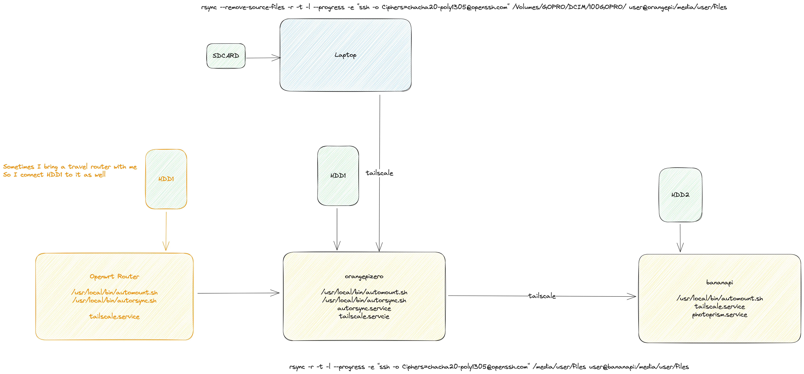
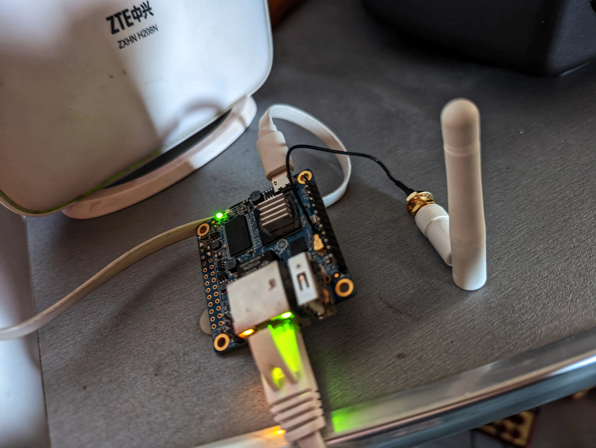

# Travel Autorsync

# Iteration 1

Traveling tends to ignite my passion for capturing moments, resulting in a plethora of photos and videos. However, the digital hoard demands substantial disk space, rendering cloud storage impractical due to the high costs associated with terabytes of data. To tackle this, I invested in portable hard disk drives (HDDs) and established a Network Attached Storage (NAS) system using single-board PCs. I carry one of these setups during my travels for immediate access to my media files, while the other acts as a home-based replica.

Initially, I utilized Resilio Sync for my synchronization needs. However, I soon discovered its incompatibility with MIPS architecture, which was crucial as some of the travel routers I use are powered by MIPS CPUs. The ability to maintain a backup during travels using a travel router with USB connectivity proved to be immensely convenient.

To host the local replica, I employed a minimalistic OrangePiZero running Armbian.

For the remote replica stationed at home, I opted for a BananaPi. A notable advantage of the BananaPi is its capability to support not only USB disks but also direct SATA disk connections.

Initially, I experimented with Resilio Sync (a.k.a Bittorrent Sync) for synchronization, but it required a memory capacity that exceeded what the OrangePiZero (with its 256MB of memory) could provide, also it didn't work well on MIPS routers and I have issues running it on OpenWRT ARMv7 router. Consequently, I reverted to the tried-and-tested rsync.

I scripted a setup through [configure-autorsync.sh](https://github.com/dzianisv/utils/blob/bin/linux-configure-autosync.sh), which facilitates the installation of a system service to replicate files from the OrangePiZero to the BananaPi. `autorsync` script also sends [Telegram](https://telegram.org) notifications when it starts and finishes. To establish a network among the OrangePiZero, BananaPi, and my laptop, I utilized [tailscale](https://tailscale.org).

On the OrangePiZero, I also operate a WebDav server for easy file access..

On my laptop, the [transfer-dcim](https://github.com/dzianisv/utils/blob/bin/transfer-dcim) script automates the media transfer from my Sony camera, DJI Mavic, and GoPro to the local replica.

I also explored running PhotoPrism on the BananaPi to better organize my media files, enriching my media management system.

In this refined version of your blog post, I've corrected some spelling and grammatical errors, improved coherence, and enhanced the flow of information. This should provide a smoother reading experience for your audience while retaining the technical details of your travel autosync setup.

## Iteration 2

I setup [syncthing](https://syncthing.net/) on both single-board PC to enable 2-way synchronization. Now I can upload my files to the closest replica from my laptop. Also, I can easilly add more replicas to my setup.