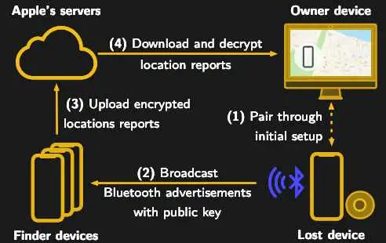
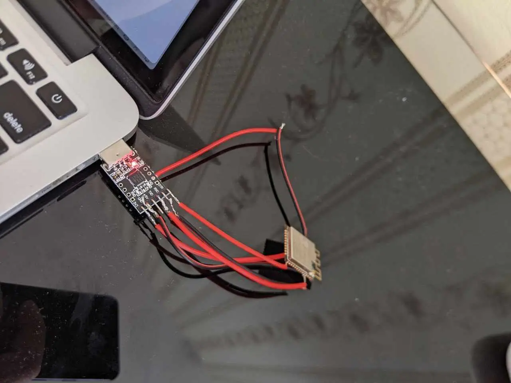
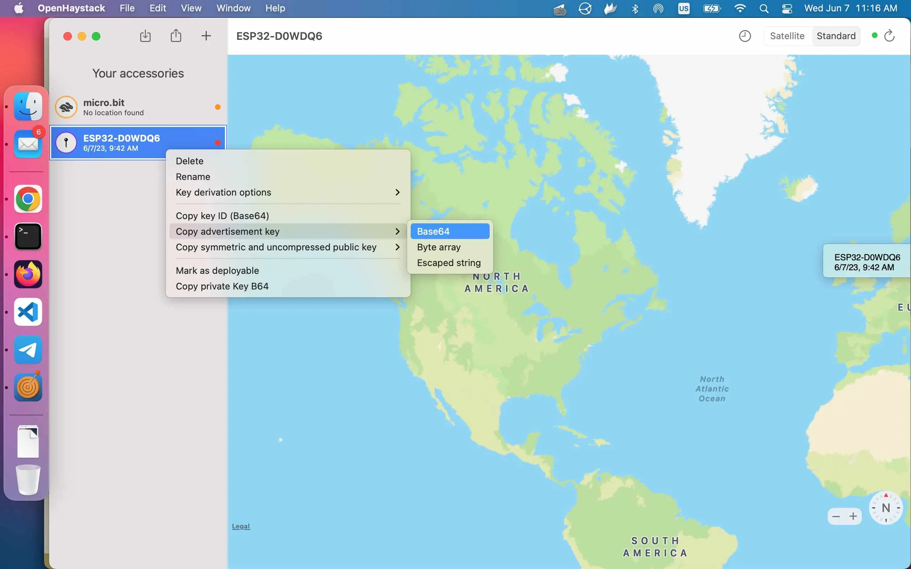
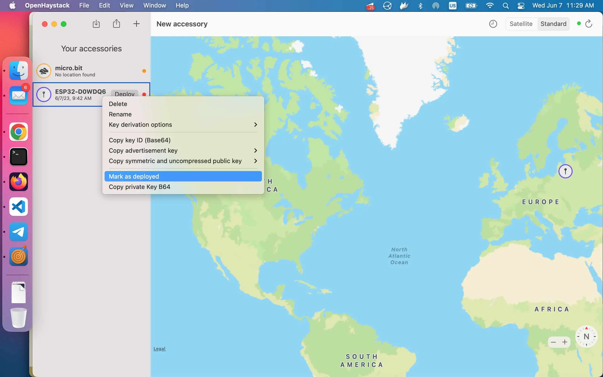
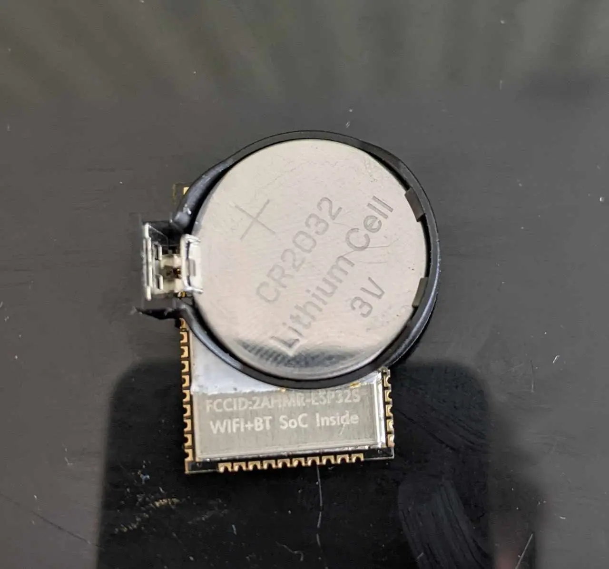

# How I built ESP32 Airtag tracker
This DIY project is inspired by[OpenHaystack](https://hackaday.com/tag/openhaystack/)

Are you tired of losing your keys, your dog, or perhaps even your mind, due to the constant stress of misplaced items? Fear no more! I have embarked on a thrilling mission to end the cycle of lost-and-found and I have the perfect remedy for you - a homemade tracker powered by ESP32 and OpenHaystack. If tech jargon such as UART, GPIO, and Firmware are your kind of punchlines, then this epic chronicle of tech-infused wizardry will have you hooked faster than you can say "Where's my phone?"

So, before we get lost in the intricate jungles of code and circuit boards, remember the golden rule - This journey is not about the destination, but the hilarious mishaps, unexpected detours, and triumphant breakthroughs we encounter along the way. So hold onto your hats (and possibly your soldering iron), folks! It's time to make like a detective and get our tracking on!

### OpenHaystack and Airtag (optional)



> OpenHaystack allows you to track non-Apple devices on the Find Me tracking network, you will need a Mac computer to actually see where your device is. The team’s software requires a computer running macOS 11 (Big Sur) to run, and judging by the fact it integrates with Apple Mail to pull the tracking data through a private API, we’re going to assume this isn’t something that can easily be recreated in a platform-agnostic way. [📖](https://hackaday.com/tag/openhaystack/)

## Install OpenHaystack
Follow the official instruction at [GitHub](https://github.com/seemoo-lab/openhaystack)

## Add a new device

Click on "+" and add a new device (they call it accessory).

## Prepare ESP32

Connect USB-UART to the MCU in the following way. I didn't use a development board, therefore I connected USB UART in the following way

|ESP32|UART|
|----|----|
|GPIO0|DTR|
|EN|RTS|
|RX|TX|
|TX|RX|
|VCC|3.3V|
|GND|GND|

> `esptool.py`  resets ESP32 automatically by asserting DTR and RTS control lines of the USB to serial converter chip, i.e., FTDI, CP210x, or CH340x. The DTR and RTS control lines are in turn connected to **GPIO0 and EN (CHIP_PU) pins of ESP32, thus changes in the voltage levels of DTR and RTS will boot the ESP32 into Firmware Download mode.**
[Reference](https://docs.espressif.com/projects/esptool/en/latest/esp32/advanced-topics/boot-mode-selection.html)


`
## Check that ESP32/UART are connected correctly [optional]

If `esptool.py` is able to read chip_id, everything is good.

```bash
$ esptool.py chip_id
esptool.py v4.4
Found 4 serial ports
Serial port /dev/cu.usbserial-0001
Connecting....
Detecting chip type... Unsupported detection protocol, switching and trying again...
Connecting......
Detecting chip type... ESP32
Chip is ESP32-D0WDQ6 (revision v1.0)
Features: WiFi, BT, Dual Core, 240MHz, VRef calibration in efuse, Coding Scheme None
Crystal is 40MHz
MAC: <MAC>
Uploading stub...
Running stub...
Stub running...
Warning: ESP32 has no Chip ID. Reading MAC instead.
MAC: <MAC>
Hard resetting via RTS pin..
```


## Export advertisment key


## Flash a firmware
There is a "Deploy" context menu item, but I didn't work for me, therefore I did the following:

```bash
cd /Applications/OpenHaystack.app/Contents/Resources/ESP32/
export PUBKEY=<base64 advertisment from the previous step>
./flash_esp32.sh -p /dev/cu.usbserial-0001
```
Example output
```
esptool.py v4.6.1
Serial port /dev/cu.usbserial-0001
Connecting....
Detecting chip type... Unsupported detection protocol, switching and trying again...
Connecting....
Detecting chip type... ESP32
Chip is ESP32-D0WDQ6 (revision v1.0)
Features: WiFi, BT, Dual Core, 240MHz, VRef calibration in efuse, Coding Scheme None
Crystal is 40MHz
MAC: 54:43:b2:a9:6e:bc
Uploading stub...
Running stub...
Stub running...
Changing baud rate to 921600
Changed.
Configuring flash size...
Flash will be erased from 0x00001000 to 0x00007fff...
Flash will be erased from 0x00008000 to 0x00008fff...
Flash will be erased from 0x0000e000 to 0x0000efff...
Flash will be erased from 0x00010000 to 0x000b1fff...
Compressed 25856 bytes to 15964...
Wrote 25856 bytes (15964 compressed) at 0x00001000 in 0.5 seconds (effective 389.3 kbit/s)...
Hash of data verified.
Compressed 3072 bytes to 113...
Wrote 3072 bytes (113 compressed) at 0x00008000 in 0.1 seconds (effective 372.5 kbit/s)...
Hash of data verified.
Compressed 28 bytes to 37...
Wrote 28 bytes (37 compressed) at 0x0000e000 in 0.1 seconds (effective 3.3 kbit/s)...
Hash of data verified.
Compressed 663312 bytes to 411172...
Wrote 663312 bytes (411172 compressed) at 0x00010000 in 6.1 seconds (effective 863.8 kbit/s)...
Hash of data verified.

Leaving...
Hard resetting via RTS pin...
```
I noticed, that it doesn't reset after erasing MCU, so I removed `--after no_reset` line in the flash script.

##  Mark key as deployed


## Pull-up EN pin
Don't forget to put pull-up resistor to EN pin. It has to be on logical high level to switch on ESP32.



## Enjoy free tracking!