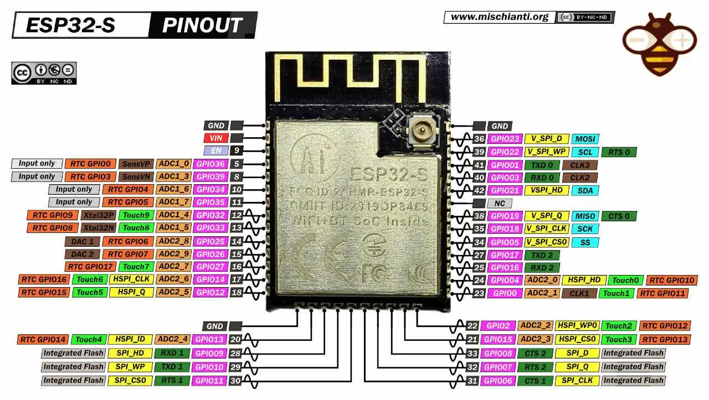

# Bare metal ESP32 flashing



GPIO0 Pulled-Up outputs PWM signal at boot, must be LOW to enter flashing mode

The ESP32 will enter the serial bootloader when GPIO0 is held low on reset. Otherwise it will run the program in flash. The ESP32 has a 45k ohm internal pull-up/pull-down resistor at GPIO0 (and other pins). If you want to connect a switch button to enter the boot mode, this has to be a strong pull-down. For example a 10k resistor to GND [Reference](https://docs.espressif.com/projects/esptool/en/latest/esp32/advanced-topics/boot-mode-selection.html)

`esptool.py`  resets ESP32 automatically by asserting DTR and RTS control lines of the USB to serial converter chip, i.e., FTDI, CP210x, or CH340x. The DTR and RTS control lines are in turn connected to **GPIO0 and EN (CHIP_PU) pins of ESP32, thus changes in the voltage levels of DTR and RTS will boot the ESP32 into Firmware Download mode.**
[Reference](https://docs.espressif.com/projects/esptool/en/latest/esp32/advanced-topics/boot-mode-selection.html)

Pinout:
|ESP32|UART|
|----|----|
|GPIO0|DTR|
|EN|RTS|
|RX|TX|
|TX|RX|
|VCC|3.3V|
|GND|GND|

## Check that it works

```
$ esptool.py chip_id
esptool.py v4.4
Found 4 serial ports
Serial port /dev/cu.usbserial-0001
Connecting....
Detecting chip type... Unsupported detection protocol, switching and trying again...
Connecting......
Detecting chip type... ESP32
Chip is ESP32-D0WDQ6 (revision v1.0)
Features: WiFi, BT, Dual Core, 240MHz, VRef calibration in efuse, Coding Scheme None
Crystal is 40MHz
MAC: <mac>
Uploading stub...
Running stub...
Stub running...
Warning: ESP32 has no Chip ID. Reading MAC instead.
MAC: <mac>
Hard resetting via RTS pin...
```