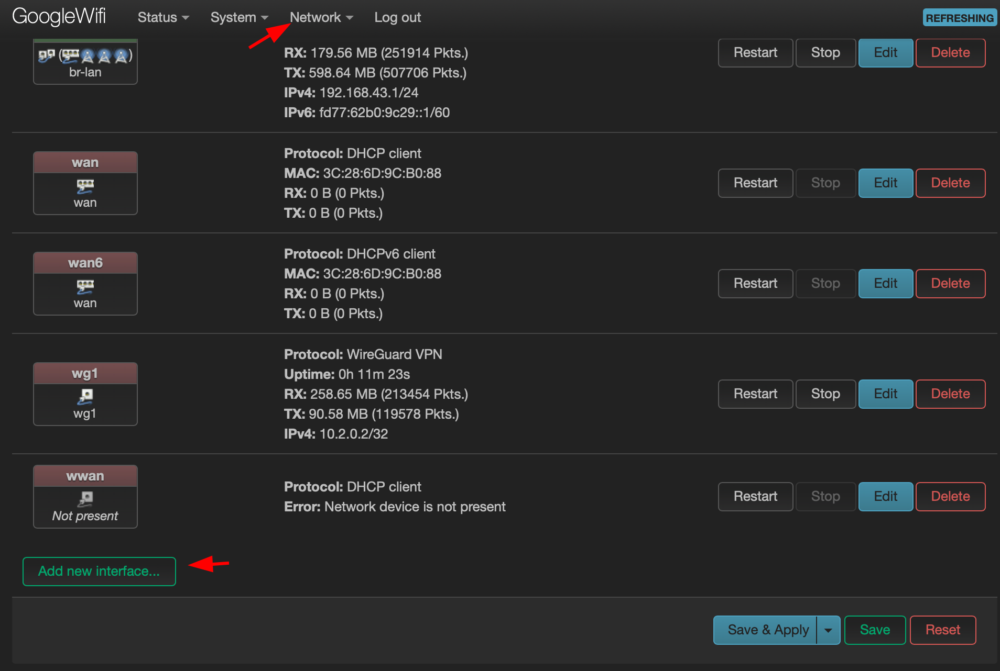

# Upgrade Google Wifi to setup Wireguard

This weekend I spent by upgrading my home network. I flashed a new OpenWRT on the Google Wifi in order to enable a lot of new features that is not supported by the stock Google Wifi firmware.


To download an OpenWRT for Google Wifi go to [firmware selector](https://firmware-selector.openwrt.org/?version=23.05.2&target=ipq40xx%2Fchromium&id=google_wifi)  


There you can put a list of the packages you want to be included in the downloaded firmware, so I included luci web interface, usb modem switch for USB LTE modem support and wireguard VPN related packages.

```
ath10k-board-qca4019 ath10k-firmware-qca4019-ct base-files busybox ca-bundle dnsmasq dropbear e2fsprogs firewall4 fstools kmod-ath10k-ct kmod-fs-ext4 kmod-fs-f2fs kmod-google-firmware kmod-gpio-button-hotplug kmod-leds-gpio kmod-nft-offload kmod-ramoops kmod-usb-dwc3 kmod-usb-dwc3-qcom kmod-usb3 libc libgcc libustream-mbedtls logd luci mkf2fs mtd netifd nftables odhcp6c odhcpd-ipv6only opkg partx-utils ppp ppp-mod-pppoe procd procd-seccomp procd-ujail uboot-envtools uci uclient-fetch urandom-seed urngd wpad-basic-mbedtls luci luci-proto-wireguard luci-app-wireguard wireguard-tools kmod-usb-net-cdc-ether usb-modeswitch luci-proto-3g comgt kmod-usb-serial kmod-usb-serial-option kmod-usb-serial-wwan chat
```

After downloading the firmware, use this [wiki](https://openwrt.org/toh/google/wifi) to flash a new firmware.

## How to setup wireguard VPN

- Install required packages: `opkg update && opkg install luci-proto-wireguard luci-app-wireguard wireguard-tools` in case yours openwrt doesn't have it, but if you followed steps above, it should contain it.
    
- "Network->Interfaces"  
    
    
- "Add new interface"  
    
    
- "Load configuration"  
    
    
- Put a configuration of your Wireguard peer  
    
 
- Add the wireguard interface to the wan firewall group 
    
- Add route with metric 100 for the Wireguard interface


- Modify metric of the previous WAN interface   
    

## Setup healthchecks

To be sure that devices is online and works as intended, I wrote a watchdog script to report online status using healthchecks.io. On healthchecks.io you can get a free telegram/email/other IM notification if devices goes offline and return online back after some downtime.

1.  Create account and device check at [healthchecks.io](https://healthchecks.io)  
    
2.  Run the following script on your openwrt device

```bash
curl "https://raw.githubusercontent.com/dzianisv/utils/4074e91d289298a056bcbbafb378b404d7616742/bin/openwrt-configure-healthchecks.sh" | URL=<healthcheck url> ash)
```

3.  PROFIT! Now you will be aware if connectivity goes down even for 1 minute, here is eample of the notification I get on telegarm: 

## Remote access to the home network over Tailscale

In order to remotelly access the remote network I use [tailscale](https://tailscale.org). It is written on golang and consumes a lot of memory, but this is still most flexible cross-OS solution I used. 

To install I followed the following [wiki](https://openwrt.org/docs/guide-user/services/vpn/tailscale/start) and in a few minutes a was able to login to the router over tailscale network. Also, tailscale can't configure the network without iptables, that was removed from new versions of OpenWRT, so you need to install `iptables-nft`

```bash
opkg update
opkg install tailscale iptables-nft
tailscale up
```


To be able to acecss the local network and LUCI web interface, you need to create unmanaged network interface and add it to the LAN firewall group


That's it, now you can ssh or login over LUCI web interface. Be connected, to the reality. 