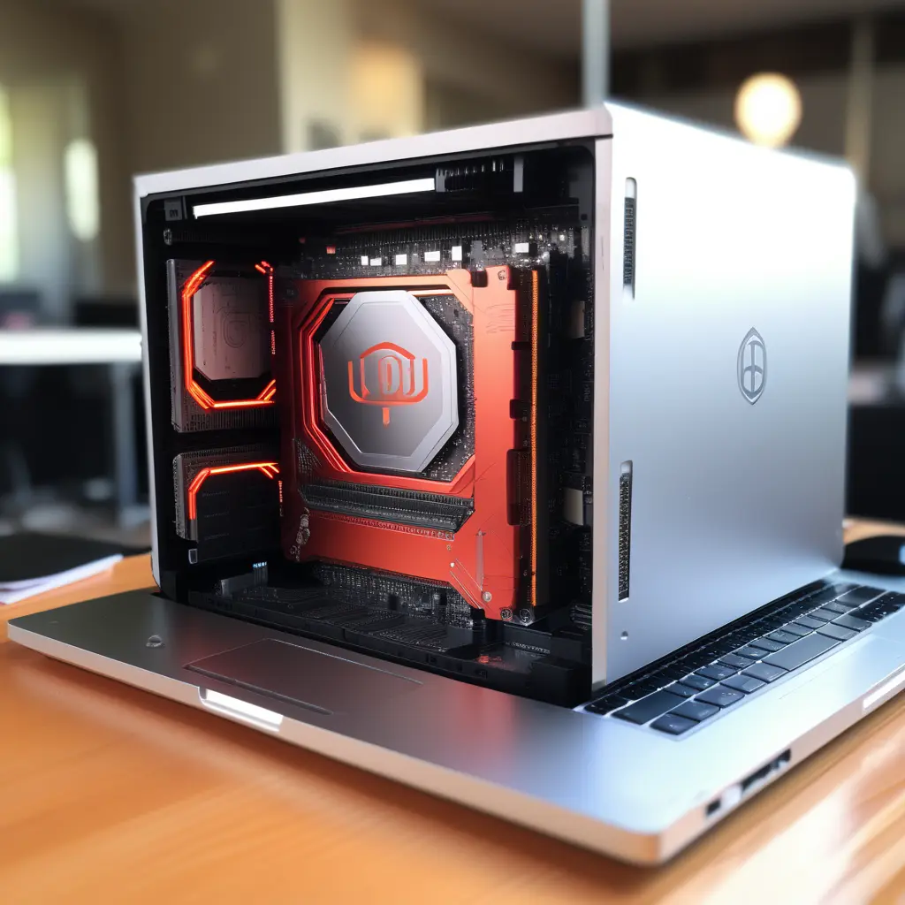
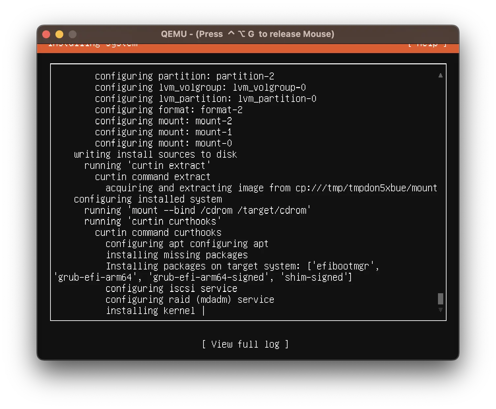
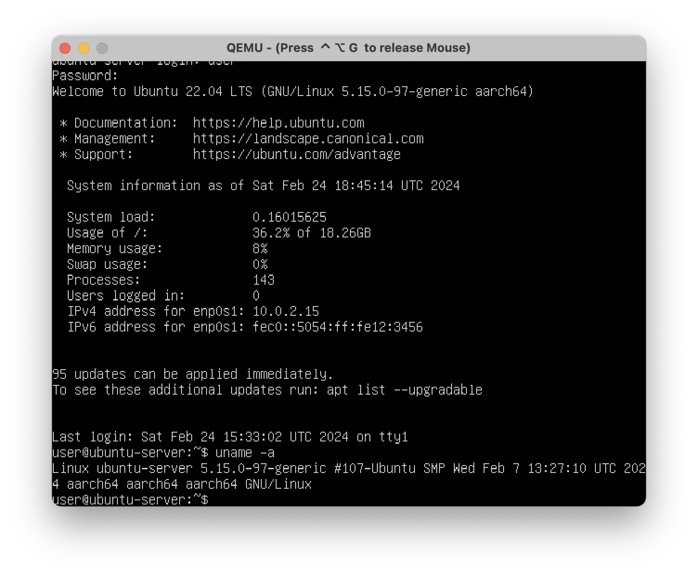

# How to Turn Your MacBook into a Ubuntu-Server Wonderland



So, you know how VirtualBox is like, "Sorry, I don't do arm64 macOS." This is first frustration after I switched to AppleSilicon macBook.But fear not! Because there is a way to make your MacBook play nice with Ubuntu without paying money for commercial virtual machines.

Step one: Brew yourself some qemu with a dash of `brew install qemu`.

Next, whip up a disk image with `qemu-img create -f qcow2 ubuntu-latest.img 40G`.

Now, let's fire up that virtual machine with Ubuntu and all its aarch64 goodness:

```bash
qemu-system-aarch64 \
   -monitor stdio \
   -M virt,highmem=off \
   -accel hvf \
   -cpu host \
   -smp 4 \
   -m 3000 \
   -bios QEMU_EFI.fd \
   -device virtio-gpu-pci \
   -display default,show-cursor=on \
   -device qemu-xhci \
   -device usb-kbd \
   -device usb-tablet \
   -device usb-tablet \
   -device intel-hda \
   -device hda-duplex \
   -drive file=ubuntu-latest.img,format=qcow2,if=virtio,cache=writethrough \
   -cdrom ubuntu-22.04-beta-live-server-arm64.iso
```

Follow the installation guide, sprinkle some magic dust, and voila! Ubuntu-server is now your virtual BFF.



To detach the ISO and make everything cozy, tweak the cmdline like a pro:

```shell
qemu-system-aarch64 \            
   -monitor stdio \
   -M virt,highmem=off \
   -accel hvf \
   -cpu host \
   -smp 4 \
   -m 3000 \
   -bios QEMU_EFI.fd \
   -device virtio-gpu-pci \
   -display default,show-cursor=on \
   -device qemu-xhci \
   -device usb-kbd \
   -device usb-tablet \
   -device usb-tablet \
   -device intel-hda \
   -device hda-duplex \
   -drive file=ubuntu.qcow2,format=qcow2,if=virtio,cache=writethrough \
```



Feeling fancy? Add another disk and connect it to your macOS host disk for a wild ride: `-drive file=/dev/disk5,format=qcow2,if=virtio,cache=writethrough`.

Behold! Ubuntu aarch64, running smoothly on your MacBook with an AppleSilicon processor. All it takes is about 30m, give or take, depending on your internet speed. Let the coding adventures begin! 🚀🍻🤓
