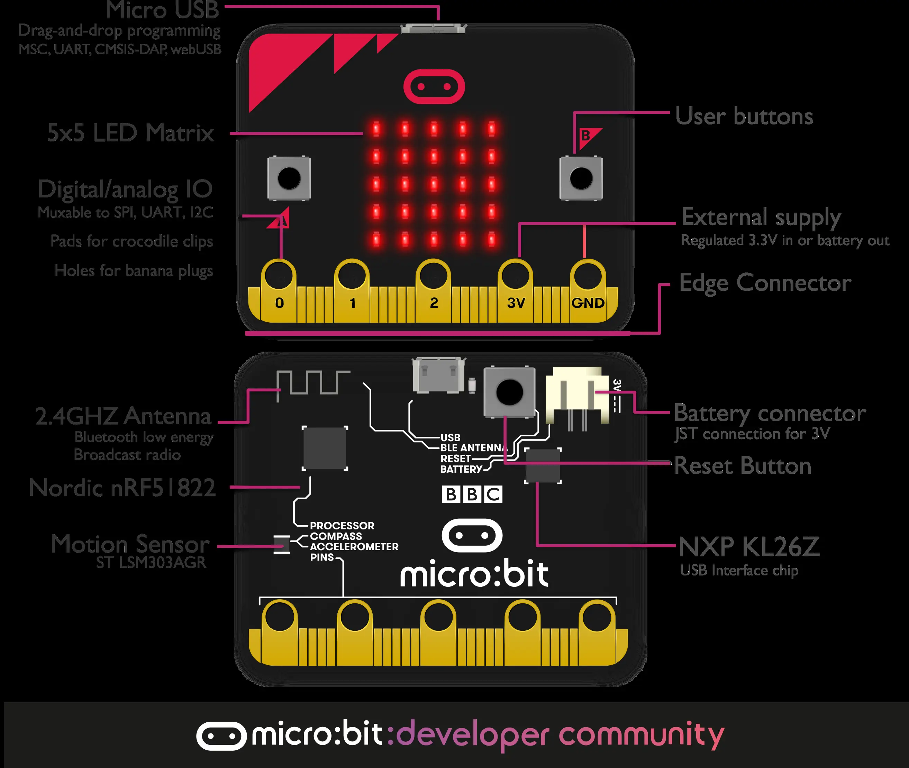
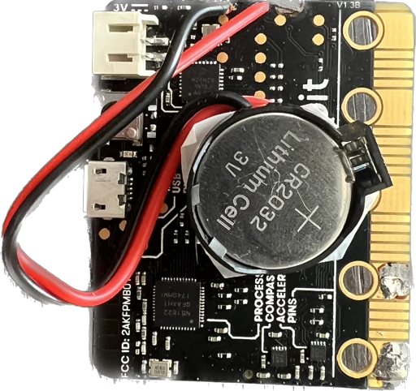
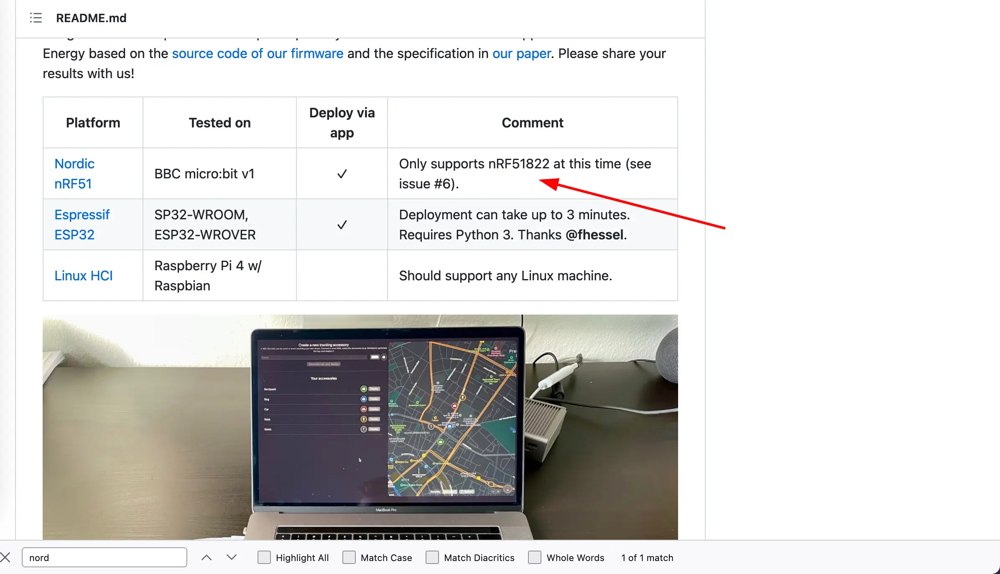
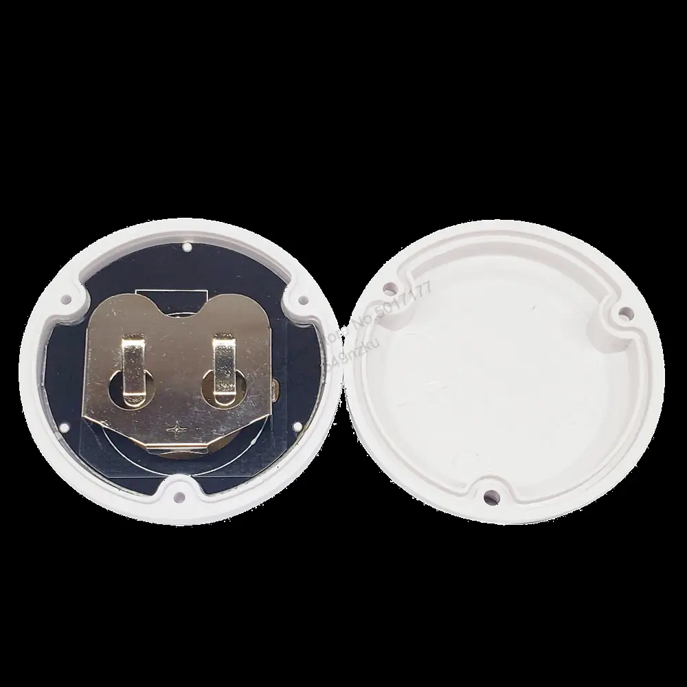
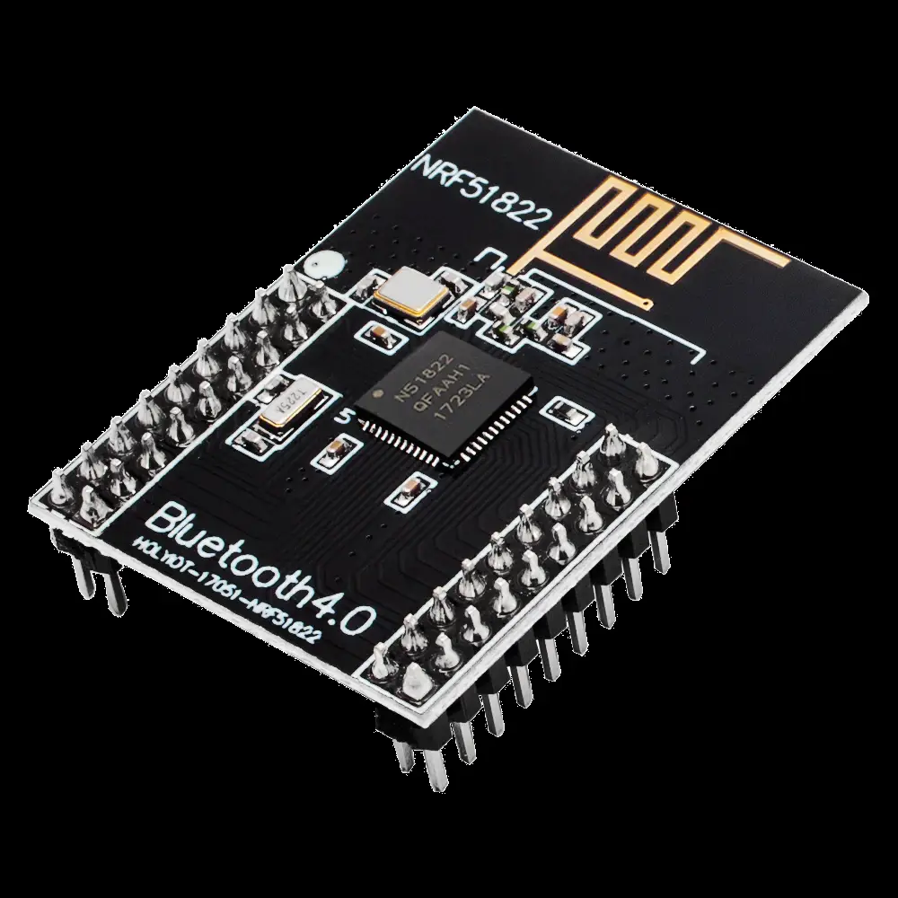
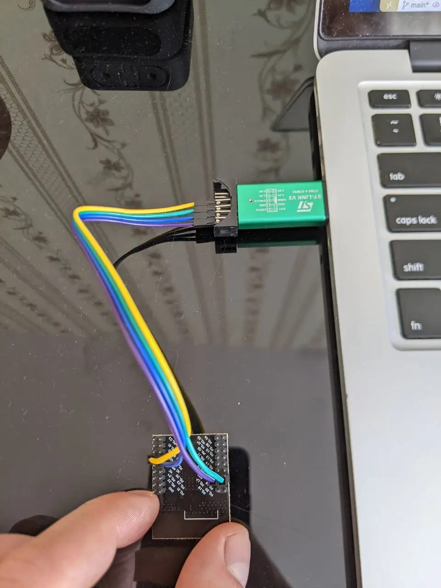
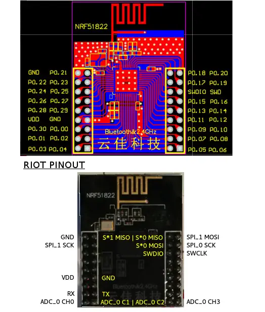
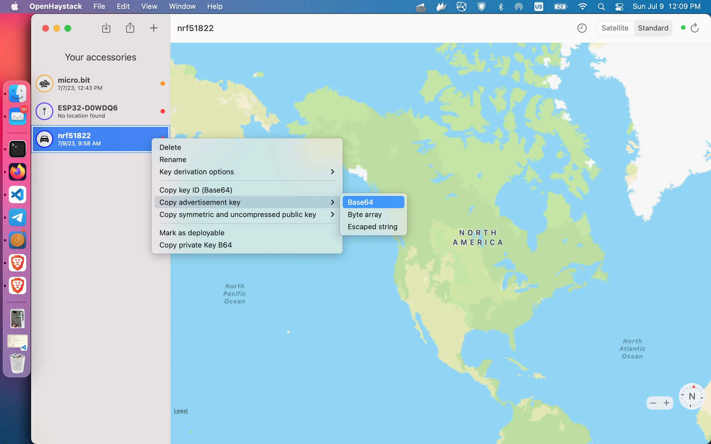
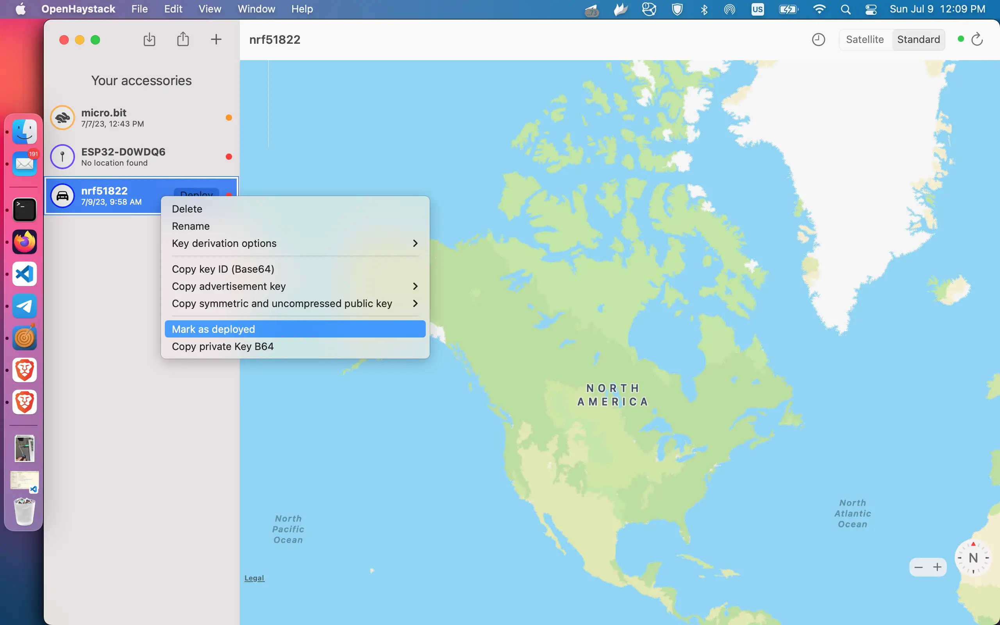

# Noridic nRF51822 Airtag

I did a first prototype of OpenHaystakTracker using [micro:bit](https://tech.microbit.org/hardware/) development board.




| | |
|-|-|
|Model|Nordic nRF51822-QFAA-R rev 3
|Core variant|Arm Cortex-M0 32 bit processor
|Flash ROM|256KB
|RAM|16KB
|Speed|16MHz
|Debug|SWD, jlink/OB




## ESP32 vs nRF51822 Power Conumption

OpenHaystack beacon works more time on micro:bit dev board (nRF51822) in comparison witth ESP32, especially on a small battery. Because ESP32 the low power modes of the ESP32 can consume between 68mA and 5µA [Reference](https://www.arrow.com/en/research-and-events/articles/esp32-power-consumption-can-be-reduced-with-sleep-modes#:~:text=The%20upshot%20to%20all%20of,between%2068mA%20and%205%C2%B5A%2C%20or%20). But nRF51822 0.6µA [Reference](https://devzone.nordicsemi.com/guides/hardware-design-test-and-measuring/b/nrf5x/posts/nrf51-current-consumption-guide#:~:text=Schematics%20for%20the%20three%20different,27%20in%20the%20PS%20v2.git), that at least 10 times less.

## Productionisation...

But micro:bit dev board is not small, so I continued to look for the better fit.
And I [found](https://github.com/seemoo-lab/openhaystack/discussions/188)

this beacon module based on nRF51822 on [~10$ Aliexpress](https://aliexpress.ru/item/1005003671695188.html)

.


Without a case just MCU costs about[1.41$ Aliexpress](https://aliexpress.ru/item/1005003470970655.html). But to flash it  you need SWD interface, like STLink V2 [1.5$ Aliexpress](https://aliexpress.ru/item/32260100115.html) using this [script](https://github.com/ddavidebor/nRF51822-OSX-ST_LINK_V2-Flasher-Script)

Here is STLink v2 -> nRF51822 pinout [Reference](https://habr.com/ru/articles/439148/)
| | |
|-|-|
ST-Link V2 	|nrf51822
3.3V 	|VDD
GND 	|GND
SWDIO 	|SWDIO
SWDCLK 	|SCLK

And script
```sh
file=<PATH_TO_HEX>
openocd -f interface/stlink.cfg -f target/nrf51.cfg -c init -c "reset halt" ^
-c "flash write_image $file 0x1c000" -c reset -c exit
```

## Dev Board



I found the following pinout for my board to connect to STLink v2, you need the following pins  SWDIO, SWDCLK, VDD, GND


## Flashing

I found a few instruction on how to flash nrf51822 using openocd. The most relevant was at this [thread](https://github.com/seemoo-lab/openhaystack/issues/35#issuecomment-828338751
). To flash an openhaystack firmware, you need to create a new devices in the app and the export Advertisement key as base64 string.



Then `export PUBKEY=<advertisement key>` and patch an firmware image with a new key. To patch the firmware I have used `key-injector.py` script.

```python3
#!/usr/bin/env python3
import sys
import re
import base64
import os

PUBKEY = os.environ.get("PUBKEY")
decoded_bytes = base64.b64decode(PUBKEY)
data = sys.stdin.buffer.read()
output_string = re.sub(b"OFFLINEFINDINGPUBLICKEYHERE!", decoded_bytes, data)
sys.stdout.buffer.write(output_string)
```


```bash
export PUBKEY=4jSeYlz7GAhKYQBjXS1Ku06A5+UjV2CfvEATNw==
firmware=opnehaystack-nrf51822-firmware.bin

./key-injector.py < /Applications/OpenHaystack.app/Contents/Resources/firmware.bin > $firmware

openocd -f interface/stlink-v2.cfg -f target/nrf51.cfg -c "init; halt; nrf51 mass_erase; program $firmware verify; program $firmware; resume;"
```

After flashing connect a battery and mark the the "device" in openhaystack as "Deployed". 

Enjoy!