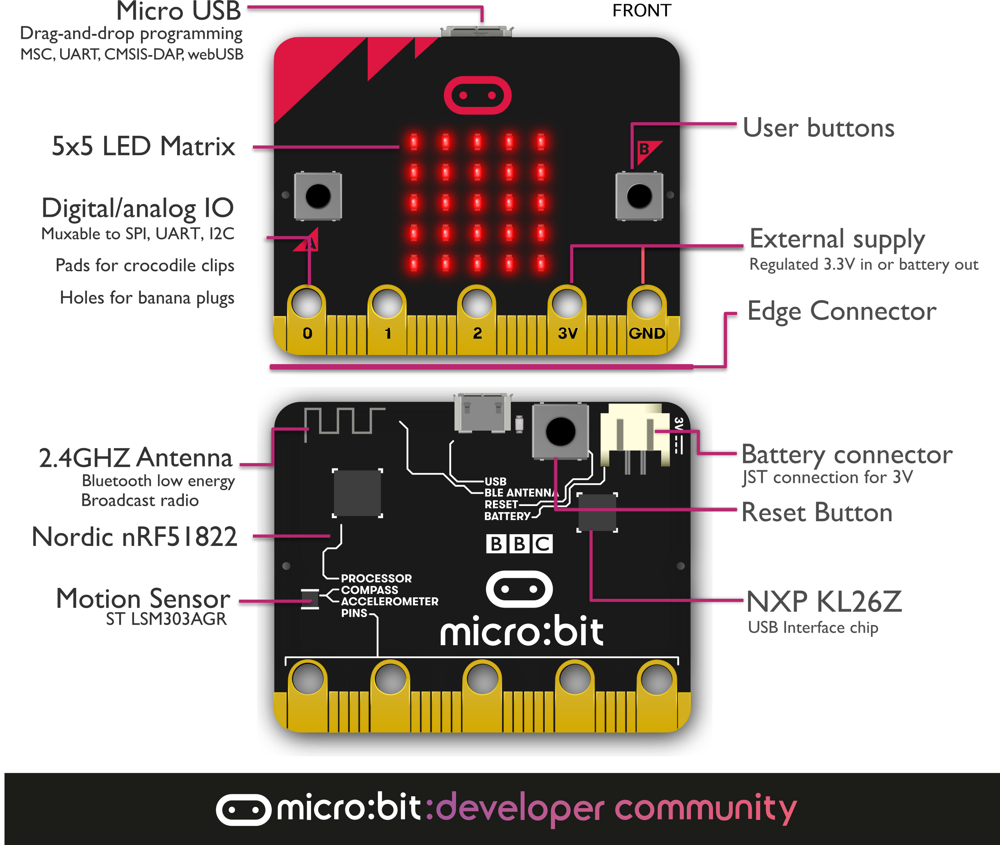
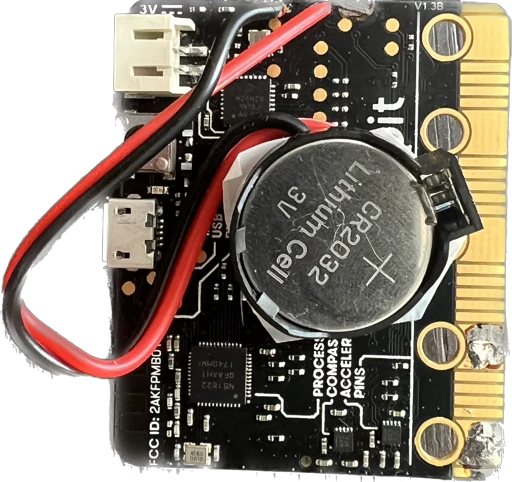
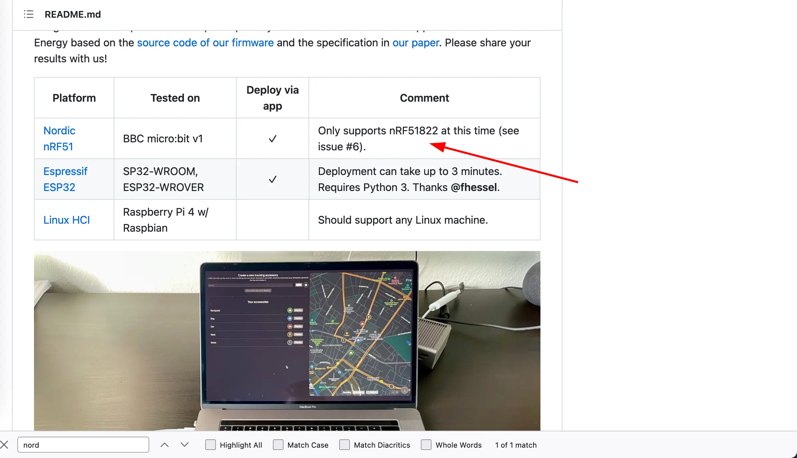
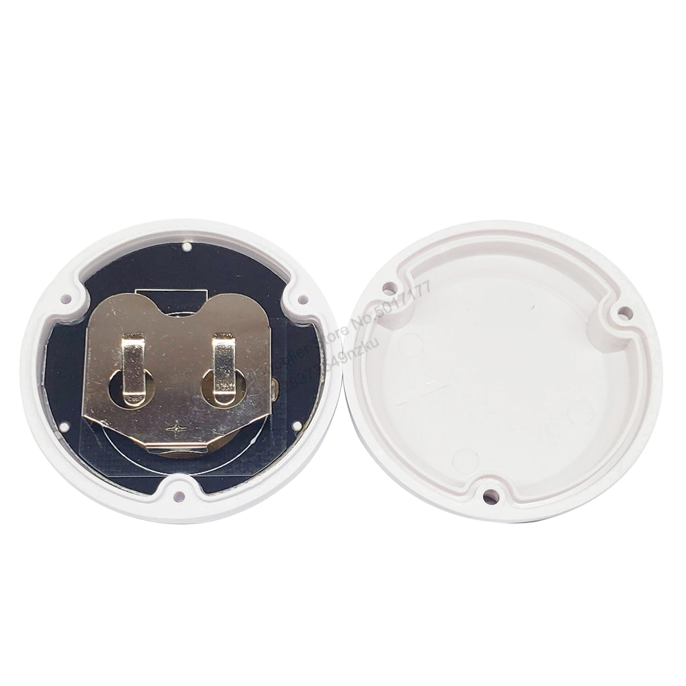
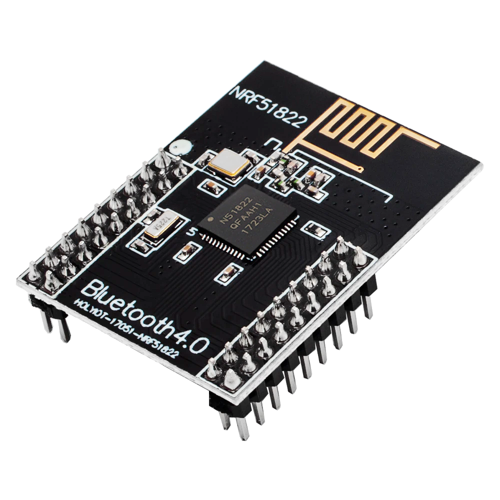

# Noridic nRF51822 Airtag

I did a first prototype on [micro:bit](https://tech.microbit.org/hardware/) development board.

| | |
|-|-|
|Model|Nordic nRF51822-QFAA-R rev 3
|Core variant|Arm Cortex-M0 32 bit processor
|Flash ROM|256KB
|RAM|16KB
|Speed|16MHz
|Debug|SWD, jlink/OB

And it works more time in comparison witth ESP32, especially on a small battery.

## Production-ready

But micro:bit dev board is not small, so I continued to look for the better fit.
And I [found](https://github.com/seemoo-lab/openhaystack/discussions/188)

this beacon module based on nRF51822 on [~10$ Aliexpress](https://aliexpress.ru/item/1005003671695188.html?gatewayAdapt=glo2rus&sku_id=12000028906157906)

.

Without a case just MCU costs about[1.41$ Aliexpress](https://aliexpress.ru/item/1005003470970655.html?sku_id=12000025936371837&spm=a2g2w.productlist.search_results.0.5f464aa610OjUU)