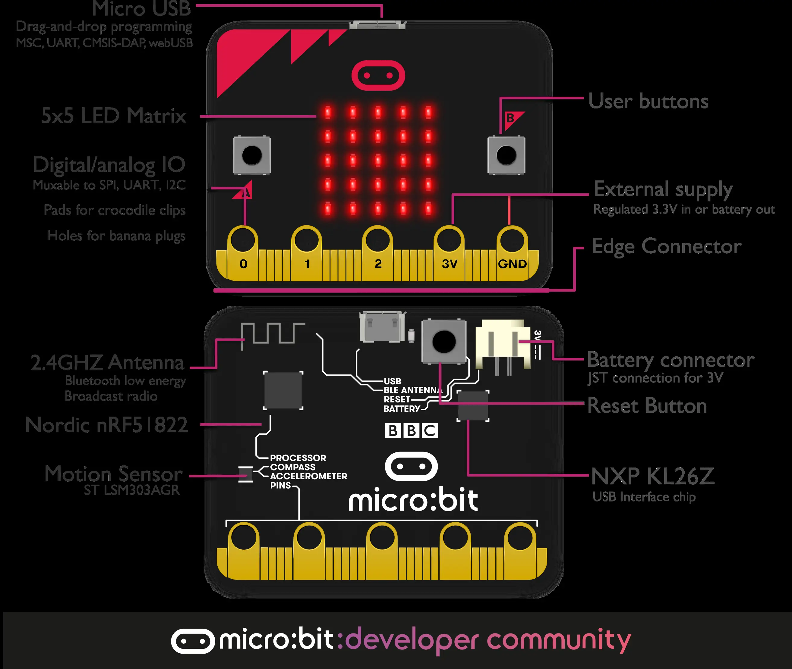
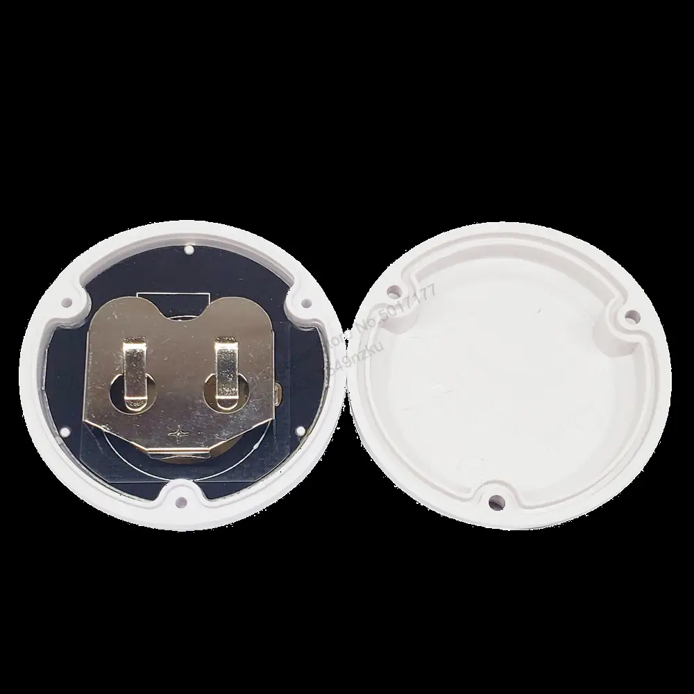
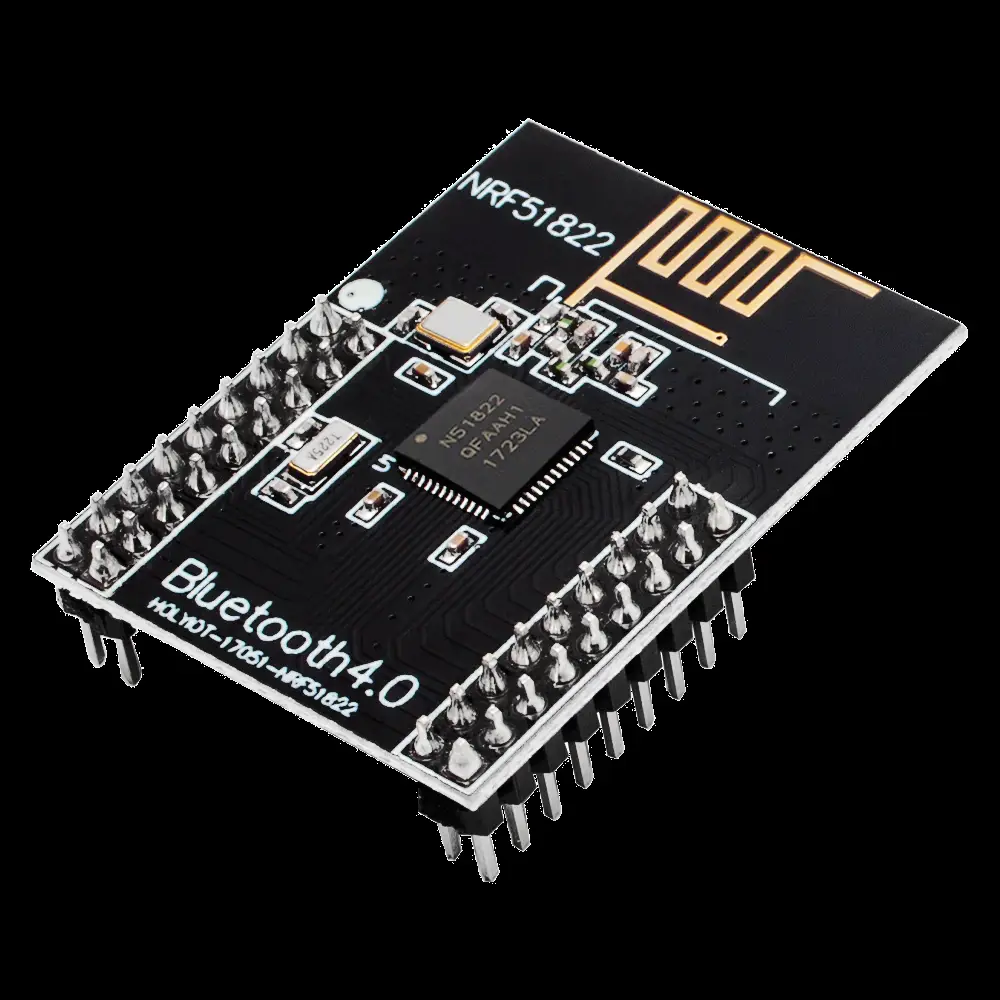

# Noridic nRF51822 Airtag

I did a first prototype on [micro:bit](https://tech.microbit.org/hardware/) development board.




| | |
|-|-|
|Model|Nordic nRF51822-QFAA-R rev 3
|Core variant|Arm Cortex-M0 32 bit processor
|Flash ROM|256KB
|RAM|16KB
|Speed|16MHz
|Debug|SWD, jlink/OB


## ESP32 vs nRF51822 Power Conumption

OpenHaystack beacon works more time on micro:bit dev board (nRF51822) in comparison witth ESP32, especially on a small battery. Because ESP32 the low power modes of the ESP32 can consume between 68mA and 5µA [Reference](https://www.arrow.com/en/research-and-events/articles/esp32-power-consumption-can-be-reduced-with-sleep-modes#:~:text=The%20upshot%20to%20all%20of,between%2068mA%20and%205%C2%B5A%2C%20or%20). But nRF51822 0.6µA [Reference](https://devzone.nordicsemi.com/guides/hardware-design-test-and-measuring/b/nrf5x/posts/nrf51-current-consumption-guide#:~:text=Schematics%20for%20the%20three%20different,27%20in%20the%20PS%20v2.git), that at least 10 times less.

## Productionisation...

But micro:bit dev board is not small, so I continued to look for the better fit.
And I [found](https://github.com/seemoo-lab/openhaystack/discussions/188)

this beacon module based on nRF51822 on [~10$ Aliexpress](https://aliexpress.ru/item/1005003671695188.html)

.


Without a case just MCU costs about[1.41$ Aliexpress](https://aliexpress.ru/item/1005003470970655.html). But to flash it  you need SWD interface, like STLink V2 [1.5$ Aliexpress](https://aliexpress.ru/item/32260100115.html) using this [script](https://github.com/ddavidebor/nRF51822-OSX-ST_LINK_V2-Flasher-Script)

Here is STLink v2 -> nRF51822 pinout [Reference](https://habr.com/ru/articles/439148/)
| | |
|-|-|
ST-Link V2 	|nrf51822
3.3V 	|VDD
GND 	|GND
SWDIO 	|SWDIO
SWDCLK 	|SCLK

And script
```sh
file=<PATH_TO_HEX>
openocd -f interface/stlink.cfg -f target/nrf51.cfg -c init -c "reset halt" ^
-c "flash write_image $file 0x1c000" -c reset -c exit
```

## Dev Board


## STLink v2
I connected board to STLink v2 to the following pins
SWDIO, SWDCLK, VDD, GND

## Flashing

To flash nrf51822 I have used the following script
```bash
#!/bin/bash
hex_firmware=$(ls -dt *.hex | head -1)
softdevice_firmware=softdevice.hex

echo "hex firmware is $hex_firmware"
echo "softdevice firmware is $softdevice_firmware"

openocd -f interface/stlink-v2.cfg -f target/nrf51.cfg -c "init ; halt; sleep 500 ; nrf51 mass_erase ; sleep 500 ; program $softdevice_firmware verify ; sleep 500 ; program $hex_firmware verify ; sleep 500 ; resume"

echo "flashing complete"
echo "hex firmware was $hex_firmware"
echo "softdevice firmware was $softdevice_firmware"
```

It flashes the .hex firmware with the latest modification time.

```bash
/usr/local/bin/flash-nrf.sh
hex firmware is NRF52_NRF52832_openHayStack.hex
softdevice firmware is softdevice.hex
Open On-Chip Debugger 0.12.0
Licensed under GNU GPL v2
For bug reports, read
	http://openocd.org/doc/doxygen/bugs.html
WARNING: interface/stlink-v2.cfg is deprecated, please switch to interface/stlink.cfg
Info : auto-selecting first available session transport "hla_swd". To override use 'transport select <transport>'.
Info : The selected transport took over low-level target control. The results might differ compared to plain JTAG/SWD
Info : clock speed 1000 kHz
Info : STLINK V2J29S7 (API v2) VID:PID 0483:3748
Info : Target voltage: 3.258964
Info : [nrf51.cpu] Cortex-M0 r0p0 processor detected
Info : [nrf51.cpu] target has 4 breakpoints, 2 watchpoints
Info : starting gdb server for nrf51.cpu on 3333
Info : Listening on port 3333 for gdb connections
[nrf51.cpu] halted due to debug-request, current mode: Thread
xPSR: 0x61000000 pc: 0x0000d16c msp: 0x20003a80
Info : nRF51822-QFAA(build code: H0) 256kB Flash, 16kB RAM
Info : Mass erase completed.
Info : A reset or power cycle is required if the flash was protected before.
[nrf51.cpu] halted due to debug-request, current mode: Thread
xPSR: 0xc1000000 pc: 0xfffffffe msp: 0xfffffffc
** Programming Started **
Error: couldn't open softdevice.hex
embedded:startup.tcl:1516: Error: ** Programming Failed **
```

It failed because a softdevice bluetooth stack has to be persented in filesystem as well.
I figured out that [for nrf51822](https://infocenter.nordicsemi.com/topic/ug_gsg_ses/UG/gsg/softdevices.html) I need [S110](https://www.nordicsemi.com/Products/Development-software/s110/download)


> SoftDevice S110 is a Bluetooth 4.1 qualified protocol stack for the nRF51 Series SoCs. It offers concurrent Peripheral and Broadcaster operation and is a complete stack with GAP, GATT, ATT, SM, L2CAP and Link Layer. Both GATT Server and Client are supported.

```bash
wget https://www.nordicsemi.com/api/sitecore/Products/MedialibraryZipDownload2

sudo cp /Users/engineer/Downloads/s110nrf51800/s110_nrf51_8.0.0_softdevice.hex  softdevice.hex
```