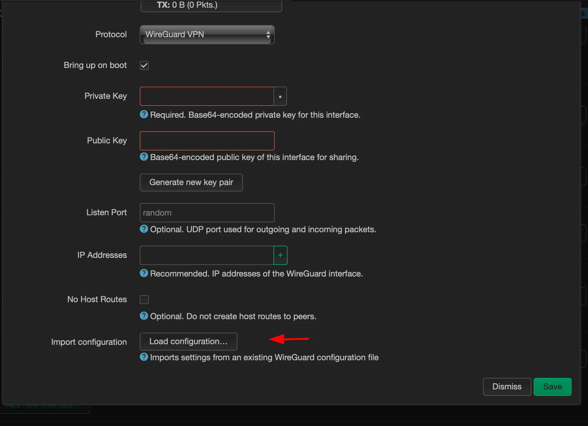

# Upgrading Google Wifi for a Wireguard Setup

So, this past weekend, I decided to level up my home network game. I went ahead and flashed a new OpenWRT firmware on my Google Wifi to unlock a whole bunch of cool features that the stock Google Wifi firmware didn't have. Yes, you heard that right – you can actually install OpenWRT on Google Wifi!


To download an OpenWRT firmware for Google Wifi, head over to the [firmware selector](https://firmware-selector.openwrt.org/?version=23.05.2&target=ipq40xx%2Fchromium&id=google_wifi)  


There, you can select a list of packages to be included in your downloaded firmware. I went for the Luci web interface, USB modem switch for USB LTE modem support, and Wireguard VPN packages.

```
ath10k-board-qca4019 ath10k-firmware-qca4019-ct base-files busybox ca-bundle dnsmasq dropbear e2fsprogs firewall4 fstools kmod-ath10k-ct kmod-fs-ext4 kmod-fs-f2fs kmod-google-firmware kmod-gpio-button-hotplug kmod-leds-gpio kmod-nft-offload kmod-ramoops kmod-usb-dwc3 kmod-usb-dwc3-qcom kmod-usb3 libc libgcc libustream-mbedtls logd luci mkf2fs mtd netifd nftables odhcp6c odhcpd-ipv6only opkg partx-utils ppp ppp-mod-pppoe procd procd-seccomp procd-ujail uboot-envtools uci uclient-fetch urandom-seed urngd wpad-basic-mbedtls 
```

Don't forget to add these packages for configuring Wireguard and USB 3G modem setup, along with the Luci web interface for router configuration.

```
luci luci-proto-wireguard luci-app-wireguard wireguard-tools kmod-usb-net-cdc-ether usb-modeswitch luci-proto-3g comgt kmod-usb-serial kmod-usb-serial-option kmod-usb-serial-wwan chat
```

Hit that Request Build button.  
  
Then grab your shiny new firmware.  
  
Once you've got it, follow this [wiki](https://openwrt.org/toh/google/wifi) to flash the new firmware. Start by flashing it to the USB stick.


- Crack open the case and find SW7
- Do a factory reset with stock firmware (Note: if the flash fails, go back to stock before trying again)
- Hold down the Reset button (front of case)
- Power up the device using the USB-C hub. The LED will cycle through various colors: usually solid white, flashing blue...
- After about 16 seconds, the LED should blink orange. Release the Reset button
- After about 3 seconds, the LED should pulse orange and amber. Now press SW7
- The device will blink purple once or twice and reboot
- Wait a few seconds for the device to finish booting (it will pulse blue). It will start blinking purple again
- Hit SW7. The LED should turn off, and the device should boot your USB image
- If this step fails, try flashing the Google recovery image and start over.
- Wait about 30 seconds for it to boot. You should see that sweet flashing blue.
- To program your image to the main flash, connect an Ethernet cable to the LAN port and run the following SSH commands:

```sh
scp -O openwrt-ipq40xx-chromium-google_wifi-squashfs-factory.bin 

ssh root@192.168.1.1 -C "dd if=/dev/zero bs=512 seek=7634911 of=/dev/mmcblk0 count=33 && \ dd if=/tmp/openwrt-ipq40xx-chromium-google_wifi-squashfs-factory.bin of=/dev/mmcblk0"
```

## Setting Up Wireguard VPN

- Install the required packages: `opkg update && opkg install luci-proto-wireguard luci-app-wireguard wireguard-tools` – just in case your OpenWRT doesn't have them. But if you've followed the steps above, it should already be there.

- Head to "Network->Interfaces"  
    
    
- Click on "Add new interface"  
    
    
- Load up your configuration  
    
    
- Enter the configuration of your Wireguard peer  
    
    
- Add the wireguard interface to the WAN firewall group 
    
- Set up a route with a metric of 100 for the Wireguard interface  
      
    
    
- Modify the metric of the previous WAN interface   
    
    

## Setting Up Healthchecks

To make sure everything is running smoothly, I wrote a watchdog script to keep an eye on things and report the online status using healthchecks.io. With healthchecks.io, you can get free notifications on Telegram, email, or other IMs if your devices go offline and then come back online after a bit.

1.  Create an account and set up a device check on [healthchecks.io](https://healthchecks.io)  
    
2.  Run this script on your OpenWRT device

```bash
curl "https://raw.githubusercontent.com/dzianisv/utils/4074e91d289298a056bcbbafb378b404d7616742/bin/openwrt-configure-healthchecks.sh" | URL=<healthcheck url> ash)
```

3.  PROFIT! Now you'll know if your connectivity drops even for a minute. Here's an example of the notification I get on Telegram: 

## Remote Access to Your Home Network via Tailscale

For remote access to my home network, I rely on [Tailscale](https://tailscale.org). It's built in Golang and chugs memory like a champ, but it's hands-down the most flexible cross-OS solution I've used.

To set it up, I followed this [wiki](https://openwrt.org/docs/guide-user/services/vpn/tailscale/start), and within minutes, I was able to log in to my router over the Tailscale network. Just a heads-up – Tailscale can't configure the network without iptables, which was removed from newer versions of OpenWRT. So, make sure you install `iptables-nft` too.

```bash
opkg update
opkg install tailscale iptables-nft
tailscale up
```


To access the local network and Luci web interface, create an unmanaged network interface and add it to the LAN firewall group  


That's a wrap! Now you can SSH or login via the Luci web interface. Stay connected, stay real.
