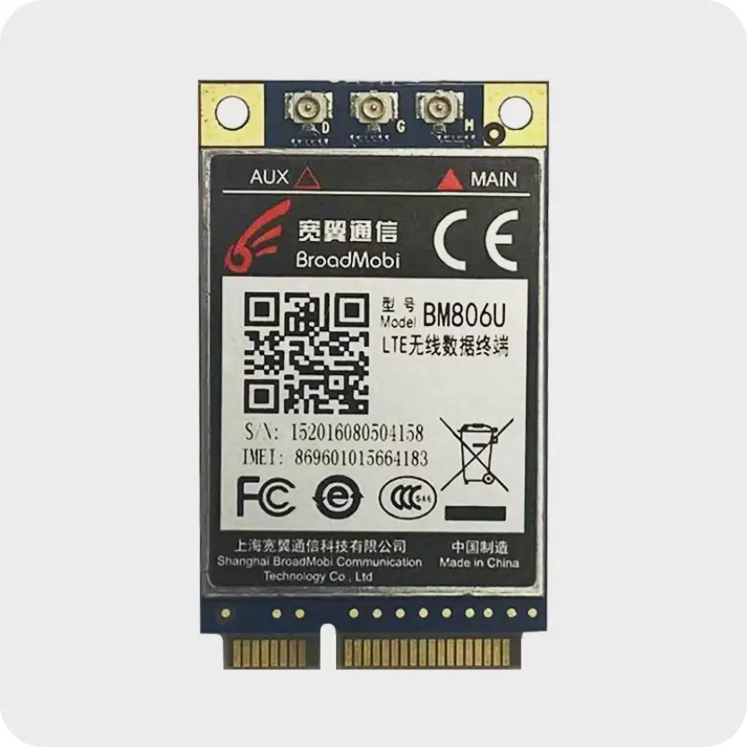

# Quick setup of OpenWRT on UniElec U7628-01 + 3G Modem

Living in a rural area, I've been stuck with only having access to ADSL internet plans that max out at 5Mbps download speeds. While usable, I've always been envious of friends in the city who can get fiber optic plans with 100Mbps or more. I got tired of dealing with sluggish video calls, long download times, and buffering when trying to stream HD videos. I decided to look into ways I could upgrade my internet speeds without having to move or pay a lot more money.

After doing some research online, I found out about using a WiFi router with a built-in PCI-Express slot and a compatible 3G/4G USB modem as a potential solution. The router acts as a bridge, taking the cellular signal from the modem and converting it into a private WiFi network and wired LAN ports. Best of all, some affordable options specifically designed for this purpose are available.

For the hardware, I went with:

[40$ UniElec U7628-01](https://aliexpress.ru/item/32816981605.html?spm=a2g2w.orderdetail.0.0.41334aa6mFtUZ1&sku_id=64789943590)


[18$ LTE 3G module BM806U](https://aliexpress.ru/item/1005003907236172.html?spm=a2g2w.orderdetail.0.0.7ce34aa6s8FTbg&sku_id=12000027436374057)


Installing the modem into the router was very easy - I just had to insert it into the PCI-E slot and secure it with a screw. Flashing the router with OpenWRT was a bit more involved but I found a good [guide](https://openwrt.org/toh/unielec/u7628-01) online that walked through the process.

An extra step I need to install LUCI web interface. Because latest openwrt firmware image doesn't have a lot of packages that you could expect. Also, you need to install pacakges for 3g modem support. To this list I add a wireguard client as well.

```bash
opkg update
opkg install luci luci-proto-wireguard luci-app-wireguard wireguard-tools kmod-usb-net-cdc-ether usb-modeswitch luci-proto-3g comgt kmod-usb-serial kmod-usb-serial-option kmod-usb-serial-wwan chat
```

Once set up, I configured the APN settings for my carrier and set a WiFi password for my new "home" network. After reloading network everything, I was excited to run some speed tests - I was now getting 20Mbps download and 5Mbps upload speeds for the same monthly cost as my old 5Mbps ADSL plan!

This new setup has been working flawlessly for months now. I'm able to have multiple HD video streams, download files much quicker, and make crystal clear video calls. The modem seamlessly fails over to 3G when 4G is not available, so I haven't had any interruptions. And because WiFi is integrated, I now have better wireless coverage across my entire house.

For anyone else stuck with slow ADSL or cable internet, I highly recommend looking into this router and modem combination. It delivers fiber-like speeds at a fraction of the cost. Feel free to reach out if you have any questions! I'm happy to help others get better connected.
