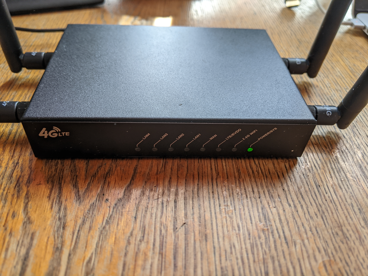
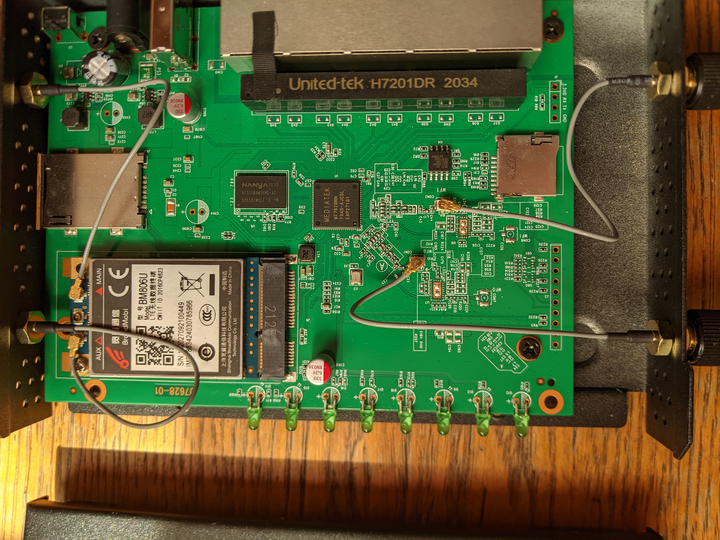
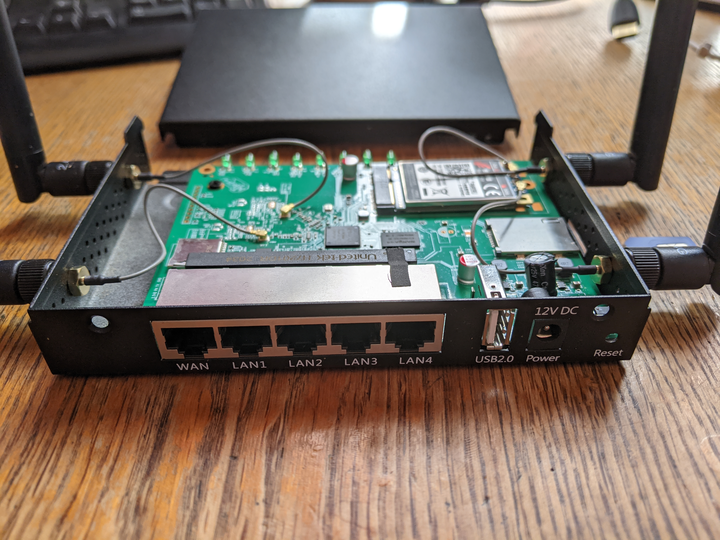
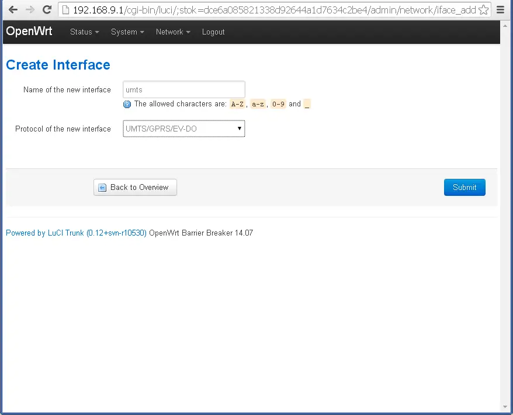
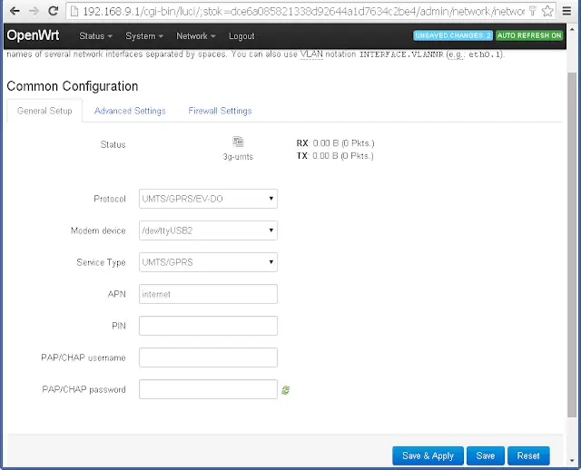

# Boosting My Rural Internet Speed with OpenWRT and a 3G Modem

Living in the countryside has its perks, but high-speed internet isn't one of them. I was stuck with a snail-paced 5Mbps ADSL connection, while my city friends boasted about their 100Mbps fiber optic plans. Tired of the buffering and laggy video calls, I decided to take matters into my own hands.

## The Hardware Hunt

After scouring the internet, I stumbled upon a solution: a WiFi router with a PCI-Express slot and a 3G/4G USB modem. This setup would convert cellular signals into a private WiFi network and wired LAN. The best part? There are budget-friendly options tailored for this.

### The Router: [UniElec U7628-01](https://aliexpress.ru/item/32816981605.html?spm=a2g2w.orderdetail.0.0.41334aa6mFtUZ1&sku_id=64789943590) - $40



This quirky router, reminiscent of building blocks, boasts a 580MHz MediaTek MT7628AN processor, 64MB DDR2 RAM, and 16MB flash storage. With 4 LAN ports, dual-band WiFi, and a USB 2.0 port, it's a steal. The cherry on top? The PCI-E slot for the 3G/4G modem.

### The Modem: [LTE 3G module BM806U](https://aliexpress.ru/item/1005003907236172.html?spm=a2g2w.orderdetail.0.0.7ce34aa6s8FTbg&sku_id=12000027436374057) - $18


## Setting Things Up

Inserting the modem was a breeze. Just pop it into the PCI-E slot and secure it. The router came with a custom OpenWrt 17 build, but I wanted the latest and greatest.




Flashing it with OpenWRT was slightly tricky, but [this guide](https://openwrt.org/toh/unielec/u7628-01) was a lifesaver.

```bash
cd /tmp
wget https://downloads.openwrt.org/releases/22.03.5/targets/ramips/mt76x8/openwrt-22.03.5-ramips-mt76x8-unielec_u7628-01-16m-squashfs-sysupgrade.bin -O sysupgrade.bin
sysupgrade -v /tmp/sysupgrade.bin
```

You also could upgrade router over Web interface LUCI.
The latest OpenWRT firmware is a bit barebones, so I had to manually install the LUCI web interface and packages for the 3G modem. I also threw in a wireguard client for good measure.

```bash
opkg update
opkg install luci luci-proto-wireguard luci-app-wireguard wireguard-tools kmod-usb-net-cdc-ether usb-modeswitch luci-proto-3g comgt kmod-usb-serial kmod-usb-serial-option kmod-usb-serial-wwan chat
```

Once set up, I configured the APN settings for my carrier and set a WiFi password for my new "home" network




After reloading network everything, I was excited to run some speed tests - I was now getting 20Mbps download and 5Mbps upload speeds for the same monthly cost as my old 5Mbps ADSL plan!

This new setup has been working flawlessly for months now. I'm able to have multiple HD video streams, download files much quicker, and make crystal clear video calls. The modem seamlessly fails over to 3G when 4G is not available, so I haven't had any interruptions. And because WiFi is integrated, I now have better wireless coverage across my entire house.

# The Perks

Months in, and this setup hasn't missed a beat. HD streaming, faster downloads, and crystal-clear video calls are now the norm. The modem's 3G fallback ensures uninterrupted service, and the integrated WiFi blankets my entire home in strong signal.

For the tech-savvy, OpenWRT's flexibility is a boon. I tweaked the TTL of my packets, ensuring my usage remains under the radar.

```bash
echo "nft add rule inet fw4 mangle_forward ip ttl set 65" >> /etc/firewall.user
echo "net.ipv4.ip_default_ttl=65" > /etc/sysctl.d/99-ttl.conf
echo -e "config include\n\toption path '/etc/firewall.user'\n\toption fw4_compatible '1'" >> /etc/config/firewall
/etc/init.d/network restart
```

# Wrapping Up

If you're grappling with slow internet, consider this router-modem duo. It's a cost-effective way to enjoy fiber-like speeds. Got questions? Drop a comment, and I'll be happy to assist!
