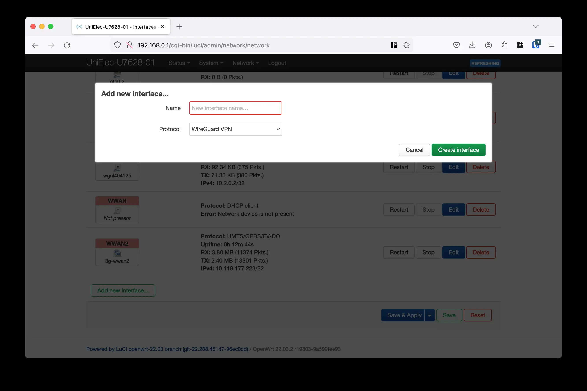
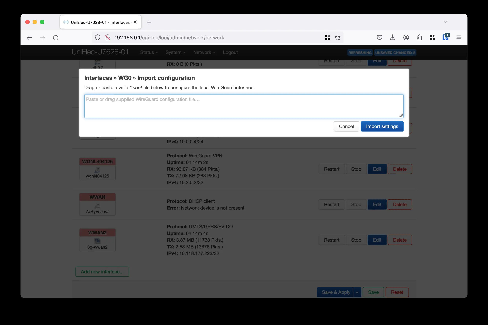

In this short article I will explain how did I configure a multi-SSID OpenWRT router that service as a home Wireguard WiFi router. Main work is done by the configuration script I was writing and debugging for a few days.

### 1. Configure a `privateLan` openwrt network

```bash
cat > /tmp/configure && ash /tmp/configure

```

Put the content of the following [script](https://github.com/dzianisv/utils/blob/f44fa7a238135f7e92197e88bc478c5bf42777a4/bin/openwrt-configure-privateLan.sh). Then pres Ctrl+D.

This script does few things:
1. Creates `privateLan` and `br-privateLan` 192.168.64.1/24.
2. Creates routing table `privateLan`.
3. Creates hotplug scripts that are triggered on each network confiugration change, or when `ifup`, `ifdown` are executed. This scripts configure routing table to route all the ip packets from the `privateLan` interface into `wg` Wireguard VPN interface, and route everything from `lan` interfance into the previous default interface `wwan`.
4. Adds bypass routes for the local hosts, to not route everything to the VPN. For instance, if you are living in the Poland and you don't want to route IP packets with Polads IP's to VPN.


### 2. Confiugre Wireguard


Install requried packages
```bash
opkg update
opkg install luci-proto-wireguard luci-app-wireguard wireguard-tools
```


And then go to Network->Interfaces->Add new intrface

Name: wg0
Protocol: Wireguard VPN



Then put a configuration of the Wireguard VPN into the textare after clicking on "Load configuration"




### 3. Add a gateway for the Wireguard interface

For my interface wg0 I set a gateway 10.2.0.1.
This is needed, because a default gateway is not presented in the OpenWrt configuration

```bash
uci set network.wg0.gateway=10.2.0.1
uci commit network
```

### 4. Add a new wireleass Access point and

Network->Wireless->Add
Type in details of the access point and choose Network: privateLan


### 5. Restart network

```bash
/etc/init.d/network restart
```

## Troubleshooting

1. Check routing table of the privateLan
There has to be a default route to the wireguard gateway you have added at step [3], and backup default route to the main wwan interface (in my case 3g-wwan2).

```bash
ip route show table privateLan | grep default

default via 10.2.0.1 dev wgnl404125
default via 10.64.64.64 dev 3g-wwan2  metric 500
```

2. Check main routing table

There has to be a default route to the main wwan interface you use, in may case 3g-wwan2.

```bash
ip route show | grep default

default via 10.64.64.64 dev 3g-wwan2
```

3. Check ip routing rules

There has to be rule for a privateLan network 192.168.64.1/24

```bash
ip rule show

32765:	from 192.168.64.1/24 lookup privateLan
```

4. Check network interfaces

There has to be wireguard interface (`wg0` in my case) and `br-privateLan`.

```bash

# ip -4 a
1: lo: <LOOPBACK,UP,LOWER_UP> mtu 65536 qdisc noqueue state UNKNOWN qlen 1000
    inet 127.0.0.1/8 scope host lo
       valid_lft forever preferred_lft forever
8: br-lan: <BROADCAST,MULTICAST,UP,LOWER_UP> mtu 1500 qdisc noqueue state UP qlen 1000
    inet 192.168.0.1/24 brd 192.168.0.255 scope global br-lan
       valid_lft forever preferred_lft forever
14: 3g-wwan2: <POINTOPOINT,MULTICAST,NOARP,UP,LOWER_UP> mtu 1500 qdisc fq_codel state UNKNOWN qlen 3
    inet x.x.x.x peer 10.64.64.64/32 scope global 3g-wwan2
       valid_lft forever preferred_lft forever
19: wg0: <POINTOPOINT,NOARP,UP,LOWER_UP> mtu 1420 qdisc noqueue state UNKNOWN qlen 1000
    inet 10.0.0.4/24 brd 10.0.0.255 scope global wg1
       valid_lft forever preferred_lft forever
20: br-privateLan: <BROADCAST,MULTICAST,UP,LOWER_UP> mtu 1500 qdisc noqueue state UP qlen 1000
    inet 192.168.64.1/24 brd 192.168.64.255 scope global br-privateLan
       valid_lft forever preferred_lft forever

```

## Enjoy!