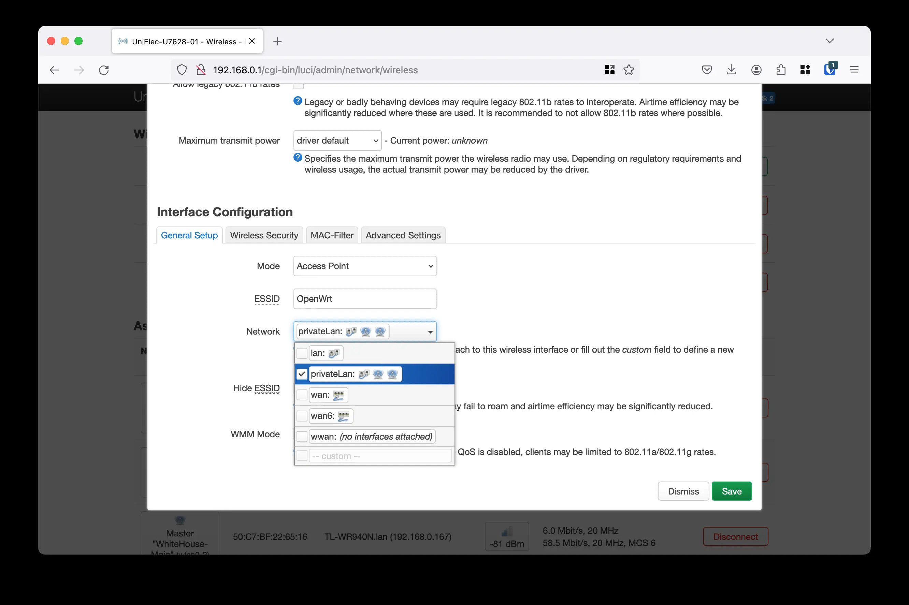

👨🏻‍💻 How I turned my boring OpenWRT router into a cool multi-SSID WiFi router using Wireguard VPN?

So, I had some free time and thought - why not make something cool out of this boring OpenWRT router? And here's how I did it 👇

### 1️⃣ Configure a `privateLan` openwrt network

First things first, I created a `privateLan` network with IP 192.168.64.1/24 and routing table `privateLan` which makes the IP packets from `privateLan` interface to go to `wg` Wireguard VPN interface.

Don't worry about copying and pasting the script, I got you covered! Check out the [link here](https://github.com/dzianisv/utils/blob/f44fa7a238135f7e92197e88bc478c5bf42777a4/bin/openwrt-configure-privateLan.sh). 

### 2️⃣ Configure Wireguard

Next up, I installed the packages `luci-proto-wireguard`, `luci-app-wireguard` and `wireguard-tools`. Then, went to Network->Interfaces->Add a new interface with the name `wg0` and protocol `Wireguard VPN`. After that, I loaded the configuration of the Wireguard VPN into the textarea, see the screenshots below.


### 3️⃣ Add a gateway for the Wireguard interface

To set a gateway for my `wg0` interface, I ran the command: 

```bash
uci set network.wg0.gateway=10.2.0.1
uci commit network
```

### 4️⃣ Add a new wireless Access point

Now, it was time to add some SSIDs! I added a new wireless access point with the details of the access point and chose Network `privateLan`.



### 5️⃣ Restart network

After all this, I restarted the network and voila! 🔥🚀 I was able to surf the net securely and my OpenWRT router had now turned into a multi-SSID WiFi router using Wireguard VPN.

If you face any issues, don't worry, I got your back. Here are some troubleshooting tips that helped me.

## Troubleshooting

1. Check routing table of the privateLan
```bash
ip route show table privateLan | grep default
```
There has to be a default route to the wireguard gateway you have added at step [3], and backup default route to the main wwan interface.

2. Check main routing table
```bash
ip route show | grep default
```
There has to be a default route to the main wwan interface you use.

3. Check ip routing rules
```bash
ip rule show
```
There has to be rule for a privateLan network 192.168.64.1/24.

4. Check network interfaces
```bash 
ip -4 a
```
There has to be a `wg0` interface and `br-privateLan`.

That's all folks! Now, I'm enjoying seamless internet experience without any hassles of network congestion. Gotta thank my free time for this banger idea. 😜
