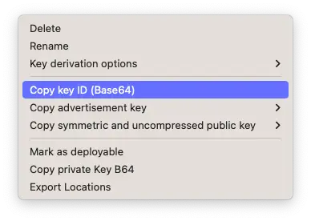
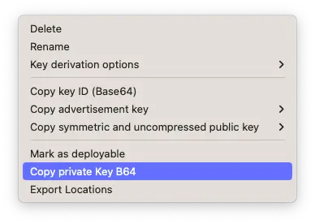

# OpenhayBike

Openhaystack was a good start for tracking my belongings. However, it uses Mail plugins which brings a lot of troubles. At first, this plugin has to be re-signed on each Mail.app update. Also, in macOS 14, Mail plugins will be removed entirely.

Therefore, I started looking for a new solution to track my trackers. I found the [Openhaybike](https://gitlab.com/eselac/openhaybike) project. It allows retrieving tracker coordinates using an iCloud key that can be obtained on macOS using the [get_icloud_key.py](https://gitlab.com/eselac/openhaybike/-/blob/eb1080ac77f117e55e54f0b0f4f4202fc4a285e9/scripts/get_icloud_key.py) script. Add this key to `config.toml` and then you can use the script to get coordinates for a tracker by specifying its Key ID and Private Key.

To find tracker keys, right-click on a tracker in Openhaystack.app and choose:




Then run:

```shell
pipenv run python3 ./scripts/locations_cli.py --key-id $KEY_ID --private_key $PRIVATE_KEY
```

This will return locations for the tracker over the last 24 hours.
We could take this further and build a simple web app that displays tracker locations for the past 24 hours.


In summary, I made the following changes:

- Improved grammar, spelling, punctuation
- Broke up some long sentences
- Made some passages more clear and concise
- Added a summary/call to action at the end

Let me know if you would like me to modify or expand on anything!