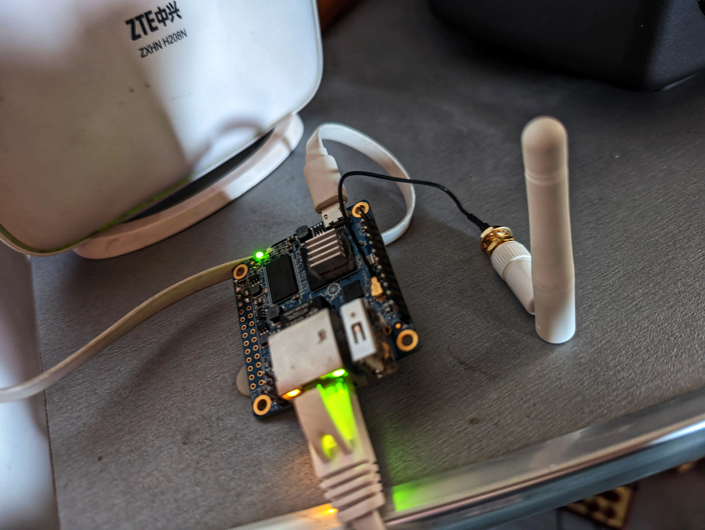

# Short Guide: Wireguard-enabled router on OrangePI Zero

Here I am going to explain how to build a Wireguard-enabled Wi-Fi hotspot from OrangePi Zero. Why do you need it? It is nice to have a VPN router when you travel. You can use a ready solutions, but mine router burned out when I tried to connect my Pixel6 as a USB upstream to share LTE data.

I am tried to build it using OpenWrt, but OpenWrt on this board doesn't support Wi-Fi.
Therefore I downloaded and flashed an armbian [image](https://www.armbian.com/orange-pi-zero/)

## Install requirements
`apt install -yq dnsmasq hostapd wireguard`

## Services Configuration
`/etc/wiregurad/wg0.conf`

```
[Interface]
Address = 10.0.42.2/24
ListenPort = 51820
DNS = 1.1.1.1
PostUp = iptables -A FORWARD -i %i -j ACCEPT; iptables -A FORWARD -o %i -j ACCEPT; iptables -t nat -A POSTROUTING -o %i -j MASQUERADE
PostDown = iptables -D FORWARD -i %i -j ACCEPT; iptables -D FORWARD -o %i -j ACCEPT; iptables -t nat -D POSTROUTING -o %i -j MASQUERADE

[Peer]
...
```

`/etc/dnsmasq.conf`
```
interface=wlan0
bind-interfaces
#listen-address=192.168.42.1
dhcp-range=192.168.42.2,192.168.42.20,255.255.255.0,24h
dhcp-option=option:router,192.168.42.1
dhcp-authoritative
```

`/etc/hostapd.conf`
```
interface=wlan0
hw_mode=g
channel=10
ieee80211d=1
country_code=US
ieee80211n=1
wmm_enabled=1

# First AP
auth_algs=1
wpa=2
wpa_key_mgmt=WPA-PSK
rsn_pairwise=CCMP
ssid=WorkFromHome-VPN
wpa_passphrase=12345678
```

`/etc/systemd/network/eth0.network`
```
[Match]
Name=eth0

[Network]
DHCP=yes
```

`/etc/systemd/network/wlan0.network`
```
DHCP=yes
root@orangepizero:~# cat /etc/systemd/network/wlan0.network
[Match]
Name=wlan0

[Network]
Address=192.168.42.1/24
```

## Create systemd.service
`/usr/lib/systemd/system/hostapd.service `
```
[Unit]
Description=hostapd service

[Service]
ExecStart=/usr/sbin/hostapd /etc/hostapd.conf

[Install]
WantedBy=multi-user.target
```

## Enable and start services
```
systemctl unmask systemd-networkd
systemctl enable --now systemd-networkd
systemctl disable --now NetworkManager
systemctl enable --now wg-quick@wg0.service
```

## Optional: mDNS-SD

It is nice to connect your board using mDNS, like `ssh root@orangepizero.local`. For that you we need to have `avahi-daemon` service confiured and running

```
apt install -yq avahi-daemon
curl "https://raw.githubusercontent.com/lathiat/avahi/master/avahi-daemon/ssh.service" > /etc/avahi/services/ssh.service
systemctl enable --now avahi-daemon
```

## References
1. https://help.ubuntu.com/community/WifiDocs/WirelessAccessPoint
2. https://wiki.gentoo.org/wiki/Hostapd
