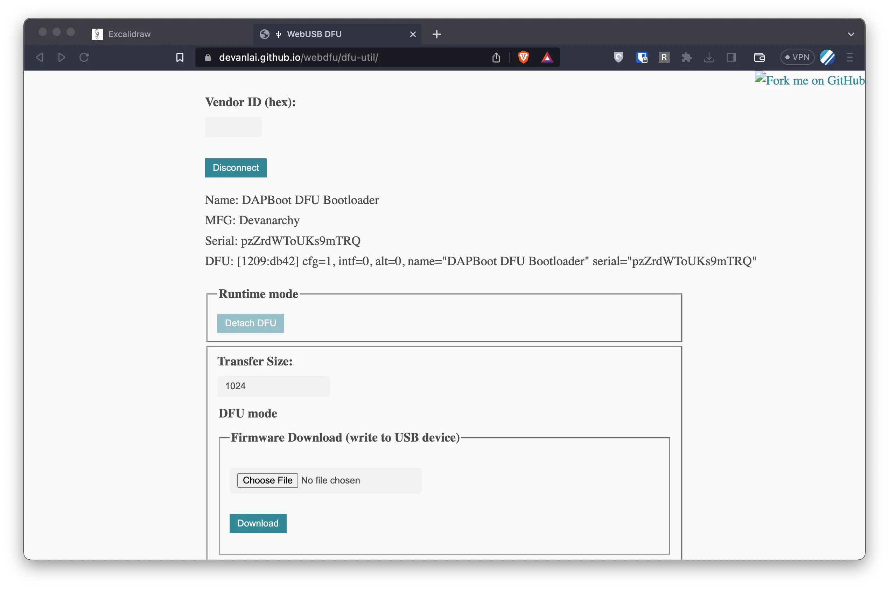
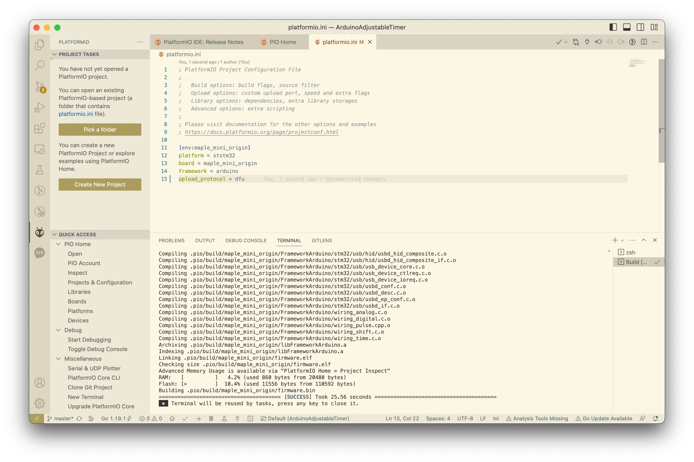

## DFU
- Bootloader for STM32F103 boards, for use with the Arduino_STM32 repo and the Arduino IDE:  https://github.com/rogerclarkmelbourne/STM32duino-bootloader/blob/master/binaries/maple_mini_boot20.bin
- Donwload DFU bootloader from https://github.com/devanlai/dapboot. I tried this but I didn't manage to start a bootloader on the board by pressing boot0 and reset.

- Maple DFU: https://github.com/jonatanolofsson/maple-bootloader
- LeafLabs DFU: http://github.com/leaflabs/maple-bootloader


## Flashing

There is 2 ways to flash a firmware to the STM32F103
- built-in bootloader that allows to download firmware over UART + stm32loader.py
- STLinkv2 + OpenOCD

## Flash DFU using STLinkv2

```
DFU=dapboot-v1.20-maplemini.bin
OOCD_INTERFACE=interface/stlink-v2.cfg
OOCD_BOARD=target/stm32f1x.cfg

openocd -f $OOCD_INTERFACE -f $OOCD_BOARD \
            -c "init" -c "reset init" \
            -c "stm32f1x unlock 0; reset halt" \
            -c "flash erase_sector 0 0 last" \
            -c "flash write_image erase ${DFU:?DFU is not set} 0x08000000" \
            -c "reset"

```

## DFU Boot
On MapleMini press and hold a user button that is connected to PB8/BOOT0

And then press reset for a short time.

It has to boot into the DFU bootloader that allows to upgrade a firmware.

## dfu-util

there is `dfu-util` tool that could be used to upload firmware.

```bash
brew install dfu-util
```

or run apt-get alternative on Debian based distros.

It detects my dev board
```bash
engineer@mybook13 Downloads % dfu-util -l
dfu-util 0.11

Copyright 2005-2009 Weston Schmidt, Harald Welte and OpenMoko Inc.
Copyright 2010-2021 Tormod Volden and Stefan Schmidt
This program is Free Software and has ABSOLUTELY NO WARRANTY
Please report bugs to http://sourceforge.net/p/dfu-util/tickets/

Found DFU: [1209:db42] ver=0111, devnum=28, cfg=1, intf=0, path="20-2", alt=0, name="DAPBoot DFU", serial="394908875083555055FF6B06"
```


## WebUSB

There is a webusb api that allows to flash MCU using Browser and JS API. Here is a [demo web app](https://devanlai.github.io/webdfu/dfu-util/)



## Create plarform.io project

I created a simple timer project using Platform.io Arduino-compatible abstractions for STM32F103 and configured to upload a firmware over [DFU](https://docs.platformio.org/en/latest/boards/ststm32/maple_mini_b20.html) bootloader in `platform.ini`




```
[env:maple_mini_origin]
platform = ststm32
board = maple_mini_origin
framework = arduino
upload_protocol = dfu
```