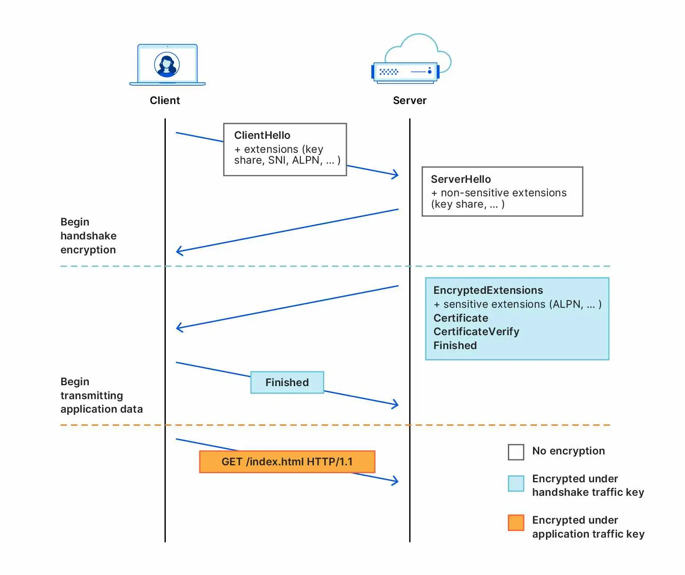
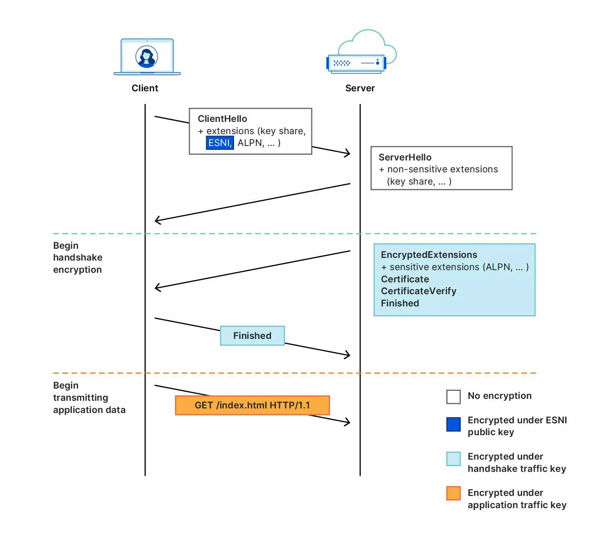
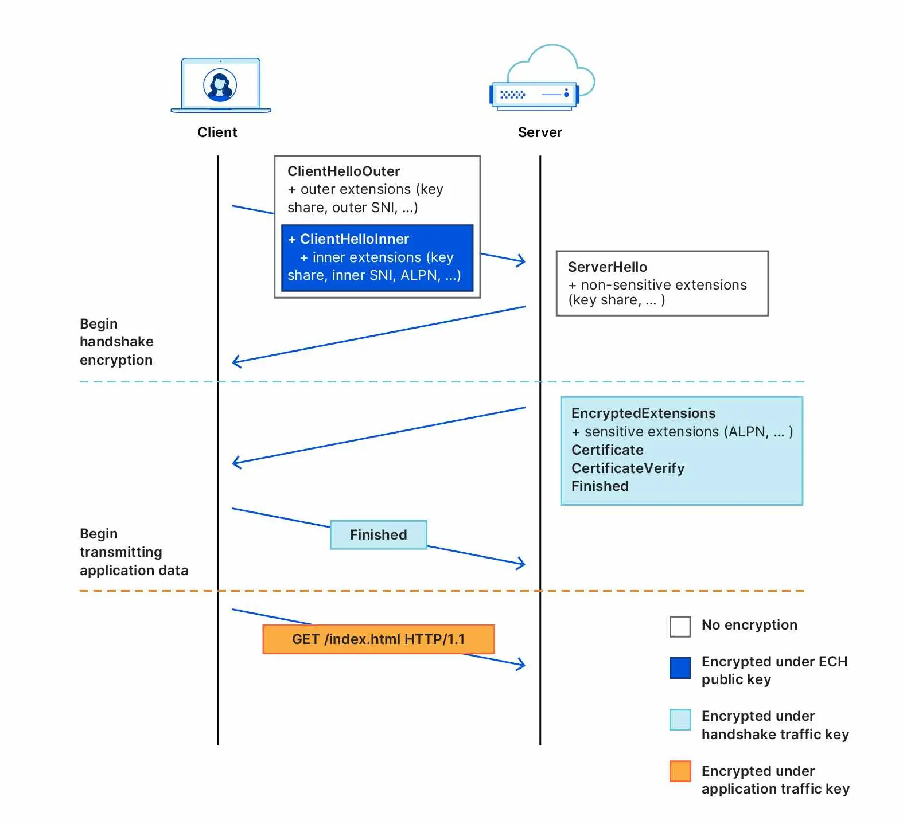

# Encrypted Client Hello (ECH)

To address the shortcomings of ESNI, recent versions of the [specification](https://datatracker.ietf.org/doc/draft-ietf-tls-esni/) no longer encrypt only the SNI extension and instead encrypt an entire Client Hello message (thus the name change from “ESNI” to “ECH”). Any extensions with privacy implications can now be relegated to an encrypted “ClientHelloInner”, which is itself advertised as an extension to an unencrypted “ClientHelloOuter”. Should a server support ECH and successfully decrypt, the “Inner” Client Hello is then used as the basis for the TLS connection. This is explained in more detail in Cloudflare’s excellent blog post on ECH. [Reference](https://blog.mozilla.org/security/2021/01/07/encrypted-client-hello-the-future-of-esni-in-firefox/)

ECH also changes the key distribution and encryption stories: A TLS server supporting ECH now advertises its public key via an HTTPSSVC DNS record, whereas ESNI used TXT records for this purpose. Key derivation and encryption are made more robust, as ECH employs the Hybrid Public Key Encryption specification rather than defining its own scheme. Importantly, ECH also adds a retry mechanism to increase reliability with respect to server key rotation and DNS caching. Where ESNI may currently fail after receiving stale keys from DNS, ECH can securely recover, as the client receives updated keys directly from the server.

## Caveats

One of the lessons learned from the deployment of TLS 1.3 is that upgrading a core Internet protocol can trigger unexpected network behavior. Cloudflare was one of the first major TLS operators to deploy TLS 1.3 at scale; when browsers like Firefox and Chrome began to enable it on an experimental basis, they observed a significantly higher rate of connection failures compared to TLS 1.2. The root cause of these failures was network ossification, i.e., the tendency of middleboxes — network appliances between clients and servers that monitor and sometimes intercept traffic — to write software that expects traffic to look and behave a certain way. Changing the protocol before middleboxes had the chance to update their software led to middleboxes trying to parse packets they didn't recognize, triggering software bugs that, in some instances, caused connections to be dropped completely. [Reference](https://blog.cloudflare.com/encrypted-client-hello/)