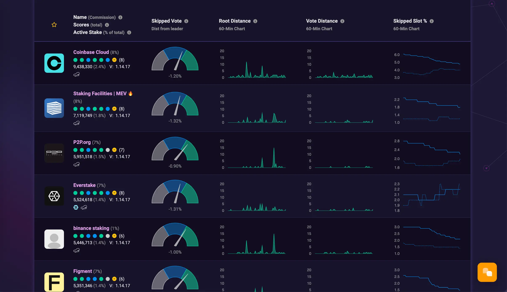
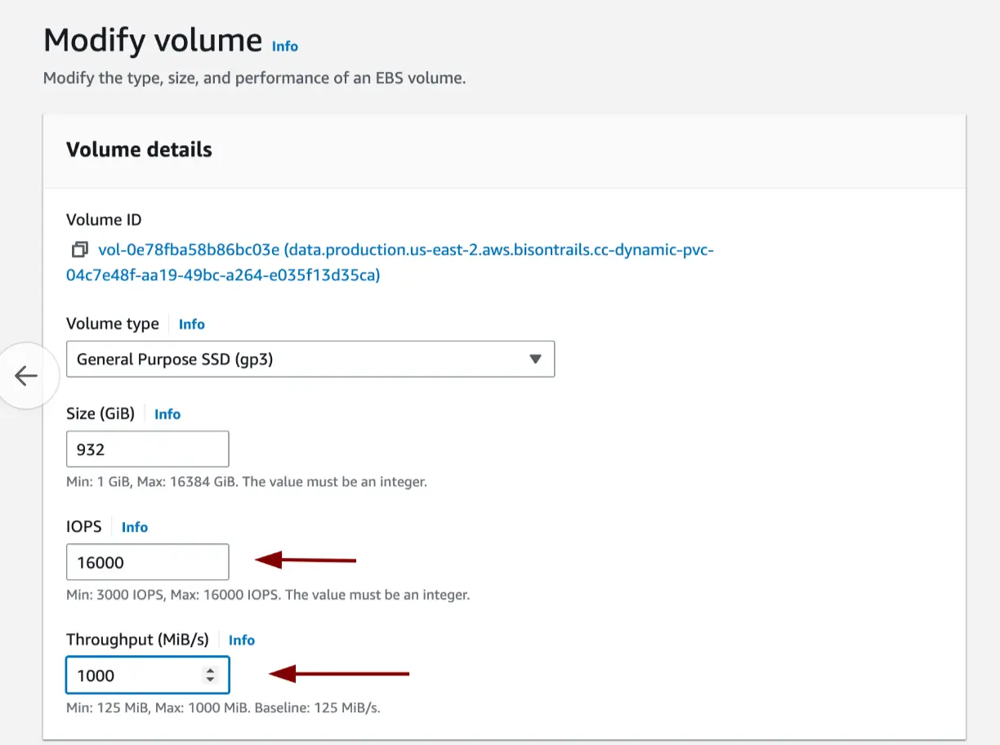
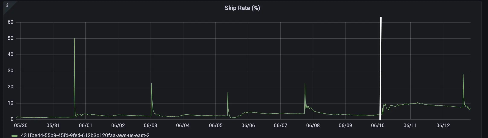

We noticed that voting skip rate is not good in our GKE cluster. Voting rate could be seen on [www.validators.app](https://www.validators.app/validators?locale=en&network=mainnet&order=stake).

Solana system resources recomendation

> CPU 12 cores / 24 threads, or more; 2.8GHz, or faster; AVX2 instruction support (to use official release binaries, self-compile otherwise); Support for AVX512f and/or SHA-NI instructions is helpful; The AMD Zen3 series is popular with the validator community

> RAM 128GB, or more

> Disk PCIe Gen3 x4 NVME SSD, or better

> The validator software runs better on high clock frequencies, so it's not only core count that matters. High boost frequencies matter just as much. A 32-core CPU @ 2 GHz will probably struggle, while a 16-core CPU @ 3 GHz can perform well. This is partly because one thread (running proof of history) will run at full capacity all the time. Older server CPUs with lower clocks are therefore less likely to be good performers, even if they have many cores.

We have had the following resources allocated for the Pod.

>CPU: 48 vCPU

>Memory: 32GB

>Storage: 1TB `type: GPT` `througput: 300MBps` `3000 IOPS`

## Optimizing storage

When I chnaged `througput: 1000MBps` and `12000 IOPS` I even noticed that perfomance degradated. `voting_skip_rate` increased from ~5% to ~9%:

