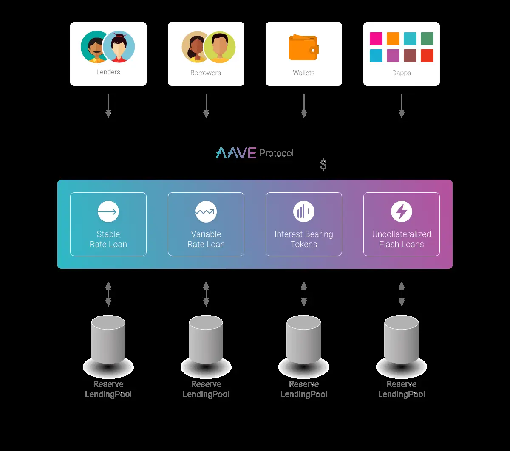

## [AAVE](https://docs.aave.com/hub/)
Liqudity-poll for lending or borrowing.

Chains: Arbitrum, Avalanche, Fantom, Harmony, Optimism, Polygon, Metis

Example APY on 2023-07-08
[Optimism](https://app.aave.com/?marketName=proto_optimism_v3)
USDT @ Optimism 2.61%
USDC @ Optimism 2.39%
EHT @ Optimism 1.30%

[Avalanche](https://app.aave.com/?marketName=proto_avalanche_v3)
USDC @ Avalanche 2.0%
AVAX @ Avalanche 2.92%

## [Compound](https://compound.finance/)
Compound III is an EVM compatible protocol that enables supplying of crypto assets as collateral in order to borrow the base asset. Accounts can also earn interest by supplying the base asset to the protocol.

Chains: Ethereum, Polygon, Arbitrum

Example APY on 2023-07-08
USDC @ [Ethereum](https://app.compound.finance/markets?market=usdc-mainnet) 5.75%
USDC @ [Polygon](https://app.compound.finance/markets?market=usdc-polygon) 1.68%
USDC @ [Arbitrum](https://app.compound.finance/markets?market=usdc.e-arb) 0.59%
Compound Treasury 4%

# [Yearn.finance]()
Yearn Finance is DeFi’s premier yield aggregator. Giving individuals, DAOs and other protocols a way to deposit digital assets and receive yield.

Chains: Ethereum, Optimism, Fantom, Arbitrum

Example of APY on 2023-07-08
USDC @ Optimism 5.89%
USDT @ Optimism 5.50%
USDC @ Ethereum 1.86%
ETH @ Ethereum 2.90%
Liqudity Provider yCRV @ Ethereum 32.34%
Staked yCRV @ 35.17%
USDC @ Fantom 1.35%

## [Beefy](https://app.beefy.com/)
Beefy is a Decentralized, Multichain Yield Optimizer that allows its users to earn compound interest on their crypto holdings

USDC @ Ethereum | Conic 8.29%
crvUSD @ Etheruem | Conic 11.83%
ETH @ Optimism | Exactly 4.78%
ETH @ Optimism | Hop 4.51%
USDC @ Optimism | Hop 4.36%
USDC @ Avalanche | Stargate 4.18%